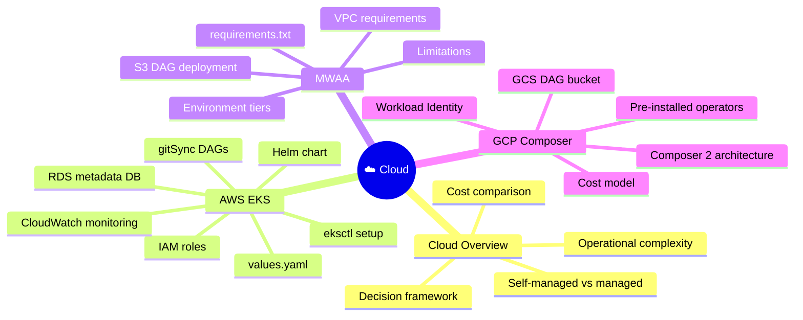
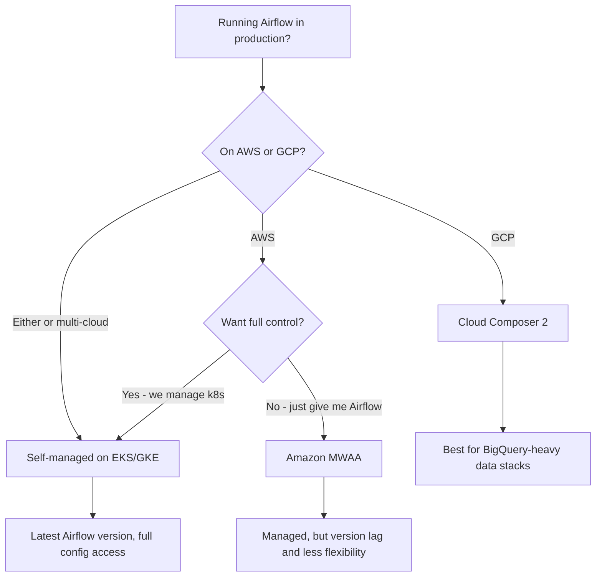

⬅️ [Airflow 3 Features](../05_Airflow_3_Features/Readme.md) &nbsp;|&nbsp; 🏠 [Home](../00_Learning_Guide/Readme.md) &nbsp;|&nbsp; [Integrations ➡️](../07_Integrations/Readme.md)

---

# ☁️ Airflow on Cloud

> *Running Airflow on your laptop is fine for learning. Running it 24/7 in production, reliably, at scale — that requires cloud infrastructure. Three paths: own everything on Kubernetes, delegate to AWS with MWAA, or delegate to GCP with Cloud Composer.*

**[Start Here → Cloud Overview (Theory.md)](37_Cloud_Overview/Theory.md)**

---

## At a Glance

| | |
|---|---|
| **Topics** | 4 modules |
| **Est. Time** | 10–12 hours |
| **Prerequisites** | 🟣 Expert Track complete, active cloud provider account |
| **Unlocks** | 🔗 Integrations |

---

## Section Map

---

## Topics

| Module | File | Description |
|--------|------|-------------|
| 37 | [Cloud Overview → Theory.md](37_Cloud_Overview/Theory.md) | Decision framework: self-managed vs MWAA vs Composer |
| 37 | [Cloud Overview → Comparison](37_Cloud_Overview/Comparison.md) | Detailed feature comparison table |
| 38 | [AWS EKS → Theory.md](38_AWS_EKS/Theory.md) | Full-control Airflow on Kubernetes |
| 38 | [AWS EKS → Setup Guide](38_AWS_EKS/Setup_Guide.md) | Step-by-step EKS deployment commands |
| 39 | [MWAA → Theory.md](39_MWAA/Theory.md) | Managed Airflow on AWS — S3, VPC, tiers |
| 40 | [GCP Composer → Theory.md](40_GCP_Composer/Theory.md) | Managed Airflow on GCP — Composer 2, Workload Identity |

---

## Decision Flowchart

---

## Cost Quick Guide

| Option | Rough Monthly Cost (small env) | Who manages infra? |
|--------|-------------------------------|-------------------|
| EKS self-managed | $150–300 (EKS + nodes) | You |
| MWAA mw1.small | ~$320 | AWS |
| Cloud Composer 2 | ~$300–500 | Google |

*Costs vary significantly by region, instance size, and usage.*

---

## Before You Start

- Expert Track complete (especially Custom Operators, Secrets, Performance)
- An active AWS or GCP account with billing enabled
- Familiarity with Kubernetes basics helps for the EKS module
- Budget for cloud resource costs if following along hands-on

---

⬅️ [Airflow 3 Features](../05_Airflow_3_Features/Readme.md) &nbsp;|&nbsp; 🏠 [Home](../00_Learning_Guide/Readme.md) &nbsp;|&nbsp; [Integrations ➡️](../07_Integrations/Readme.md)

