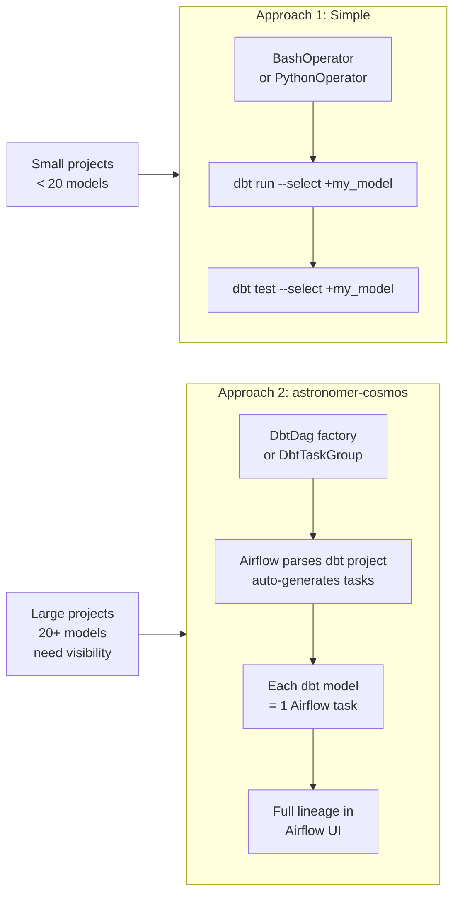

# 🔗 Airflow + dbt — Orchestrating Your Transformations

> *dbt handles data transformation, Airflow handles orchestration. Together they're the backbone of the modern data stack. You use Airflow to trigger dbt runs at the right time, pass parameters to control what gets run, and handle dbt test failures gracefully — without your analysts ever knowing something went wrong.*

---

## The Story

You have a dbt project with 50 models. They need to run every morning after raw data lands in your warehouse. Some models depend on others. Some have tests that catch bad data. When tests fail, you want a Slack alert, not a silent bad dashboard.

You could run dbt from a cron job. But cron doesn't know if the upstream data is ready. Cron doesn't alert you when a test fails. Cron doesn't let you run only some models based on a parameter.

Airflow knows all of this. You use Airflow to:
1. Wait for upstream data to land (using a sensor or asset dependency)
2. Trigger the dbt run with the right `--vars` for the date
3. Catch test failures and route them to a Slack alert task
4. Emit an Asset so downstream DAGs know the models are ready

This is the Airflow + dbt pattern.

---

## Two Approaches



---

## Approach 1: BashOperator (Simple)

The simplest approach. Run dbt commands directly from a BashOperator.

```python
from airflow.sdk import DAG
from airflow.operators.bash import BashOperator
from datetime import datetime

with DAG(
    dag_id="dbt_simple_run",
    start_date=datetime(2024, 1, 1),
    schedule="@daily",
    catchup=False,
) as dag:

    # Install dbt dependencies first (idempotent)
    dbt_deps = BashOperator(
        task_id="dbt_deps",
        bash_command="cd /opt/dbt/my_project && dbt deps",
    )

    # Run all models
    dbt_run = BashOperator(
        task_id="dbt_run",
        bash_command="""
            cd /opt/dbt/my_project && \
            dbt run \
              --profiles-dir /opt/dbt/profiles \
              --vars '{"execution_date": "{{ ds }}"}'
        """,
    )

    # Run tests — fail the task if any test fails
    dbt_test = BashOperator(
        task_id="dbt_test",
        bash_command="""
            cd /opt/dbt/my_project && \
            dbt test \
              --profiles-dir /opt/dbt/profiles
        """,
    )

    dbt_deps >> dbt_run >> dbt_test
```

---

## Approach 2: astronomer-cosmos (Production)

[astronomer-cosmos](https://astronomer.github.io/astronomer-cosmos/) parses your dbt project and automatically generates an Airflow task for each dbt model. Each model becomes a visible, independently retriable task in the Airflow UI.

**Install:**
```bash
pip install astronomer-cosmos[dbt-postgres]
# or: astronomer-cosmos[dbt-bigquery], astronomer-cosmos[dbt-snowflake]
```

### The DbtDag Factory

The quickest way: let cosmos generate the entire DAG from your dbt project.

```python
from cosmos import DbtDag, ProjectConfig, ProfileConfig, ExecutionConfig
from cosmos.profiles import PostgresUserPasswordProfileMapping
from datetime import datetime
from pathlib import Path

# Point to your dbt project
DBT_PROJECT_PATH = Path("/opt/airflow/dbt/my_project")
DBT_PROFILES_PATH = Path("/opt/airflow/dbt/profiles")

# Configure the dbt profile (how to connect to your warehouse)
profile_config = ProfileConfig(
    profile_name="my_project",
    target_name="prod",
    profile_mapping=PostgresUserPasswordProfileMapping(
        conn_id="postgres_warehouse",   # Airflow connection
        profile_args={"schema": "analytics"},
    ),
)

# Generate the entire DAG automatically
dbt_dag = DbtDag(
    dag_id="dbt_cosmos_pipeline",
    start_date=datetime(2024, 1, 1),
    schedule="@daily",
    catchup=False,

    project_config=ProjectConfig(
        dbt_project_path=DBT_PROJECT_PATH,
    ),
    profile_config=profile_config,
    execution_config=ExecutionConfig(
        dbt_executable_path="/usr/local/bin/dbt",
    ),
    operator_args={
        "install_deps": True,  # run dbt deps before each task
    },
)
```

This generates one Airflow task per dbt model, with dependencies automatically derived from your `ref()` calls.

### The DbtTaskGroup (Embedded in a Larger DAG)

More commonly, you want the dbt run to be part of a larger pipeline — extract data first, then transform with dbt, then load to a data mart.

```python
from airflow.sdk import DAG, task
from airflow.operators.python import PythonOperator
from cosmos import DbtTaskGroup, ProjectConfig, ProfileConfig
from cosmos.profiles import SnowflakeUserPasswordProfileMapping
from datetime import datetime
from pathlib import Path

profile_config = ProfileConfig(
    profile_name="analytics",
    target_name="prod",
    profile_mapping=SnowflakeUserPasswordProfileMapping(
        conn_id="snowflake_default",
        profile_args={"database": "ANALYTICS", "schema": "MARTS"},
    ),
)

with DAG(
    dag_id="full_pipeline_with_dbt",
    start_date=datetime(2024, 1, 1),
    schedule="@daily",
    catchup=False,
) as dag:

    @task
    def extract_and_load():
        """Extract from source and load to raw schema."""
        print("Loading raw data...")
        # your extraction code here

    # dbt TaskGroup: runs all dbt models as individual tasks
    transform = DbtTaskGroup(
        group_id="dbt_transform",
        project_config=ProjectConfig(
            dbt_project_path=Path("/opt/airflow/dbt/my_project"),
        ),
        profile_config=profile_config,
        # Optional: run only specific dbt models
        # render_config=RenderConfig(
        #     select=["path:models/marts"],
        # ),
    )

    @task
    def notify_downstream():
        """Notify that models are ready."""
        print("dbt models complete — data is ready.")

    extract_and_load() >> transform >> notify_downstream()
```

---

## Passing Variables to dbt

You often need to tell dbt which date to process. Use `dbt run --vars`:

```python
# With BashOperator — pass Airflow execution date to dbt
dbt_run = BashOperator(
    task_id="dbt_run",
    bash_command="""
        dbt run \
          --vars '{"execution_date": "{{ ds }}", "target_schema": "prod"}' \
          --select +stg_orders+
    """,
)
```

In your dbt model:
```sql
-- models/marts/orders_summary.sql
SELECT *
FROM {{ ref('stg_orders') }}
WHERE order_date = '{{ var("execution_date") }}'
```

---

## Handling dbt Test Failures

The default behaviour: if `dbt test` fails, the task fails, the DAG run fails. This is usually what you want.

But sometimes you want more control — log the failures, send a Slack alert, but still mark the DAG as successful so downstream tasks run.

```python
from airflow.sdk import DAG, task
from airflow.operators.bash import BashOperator
from airflow.operators.python import BranchPythonOperator
import subprocess
import json

with DAG(
    dag_id="dbt_with_test_handling",
    start_date=datetime(2024, 1, 1),
    schedule="@daily",
    catchup=False,
) as dag:

    dbt_run = BashOperator(
        task_id="dbt_run",
        bash_command="dbt run --project-dir /opt/dbt/my_project",
    )

    # Run tests with --store-failures and capture the exit code
    dbt_test = BashOperator(
        task_id="dbt_test",
        bash_command="""
            dbt test \
              --project-dir /opt/dbt/my_project \
              --store-failures 2>&1 | tee /tmp/dbt_test_output.txt
            exit ${PIPESTATUS[0]}
        """,
        # Don't propagate failure — we'll handle it ourselves
        trigger_rule="all_done",
    )

    @task(trigger_rule="one_failed")
    def handle_test_failures():
        """Called only if dbt test failed."""
        # Read the test output
        with open("/tmp/dbt_test_output.txt") as f:
            output = f.read()

        # Extract failing tests
        failing = [line for line in output.split("\n") if "FAIL" in line]
        print(f"Failed tests: {failing}")

        # Send Slack alert (or email, PagerDuty, etc.)
        # slack_hook.send(f":red_circle: dbt tests failed:\n{chr(10).join(failing)}")

        raise Exception(f"{len(failing)} dbt tests failed")

    @task(trigger_rule="all_success")
    def mark_complete():
        """Called only if everything succeeded."""
        print("All dbt tests passed!")

    dbt_run >> dbt_test >> [handle_test_failures(), mark_complete()]
```

---

## Best Practices

| Practice | Why |
|---------|-----|
| Use cosmos for projects with 10+ models | Individual tasks = individual retries + visibility |
| Always run `dbt test` after `dbt run` | Catch data quality issues before downstream consumers |
| Pass `execution_date` as a dbt variable | Ensures idempotent backfills |
| Store dbt profiles in Airflow connections | No credentials in code or files |
| Use `--select` to run incremental subsets | Faster runs for large dbt projects |
| Enable `--store-failures` in production | Failing rows saved to DB for debugging |

---

## See Also

- [Code Example →](./Code_Example.md) — Full working examples: BashOperator and cosmos DbtDag
- [Spark Integration →](../42_Spark_Integration/Theory.md) — Triggering Spark jobs from Airflow
