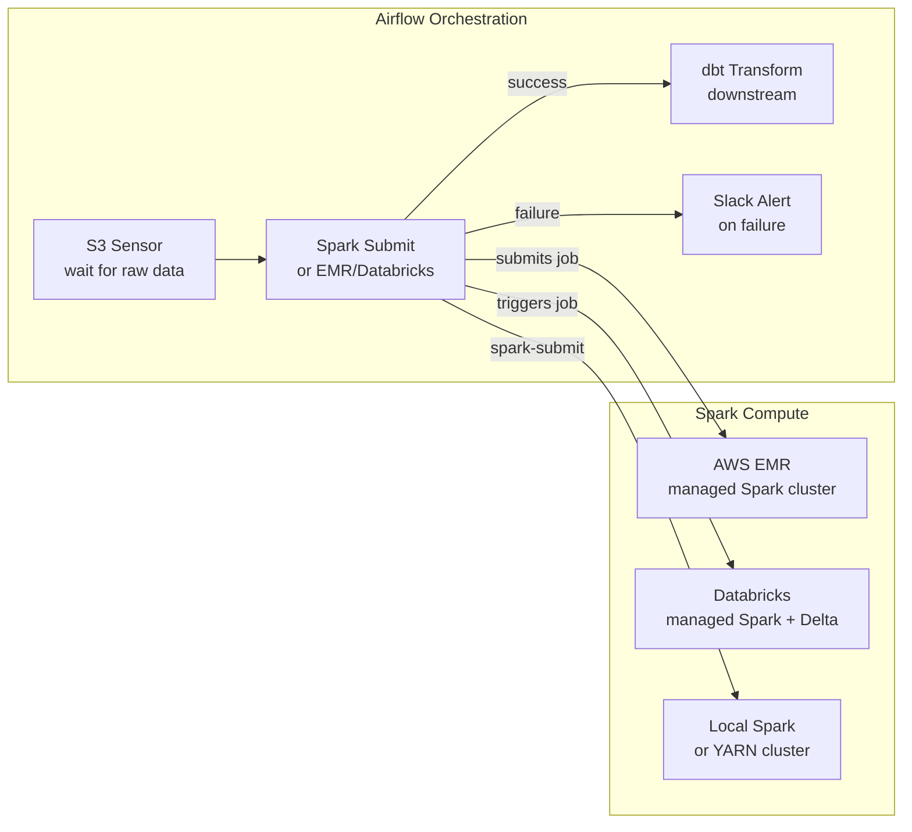

# ⚡ Airflow + Spark — Orchestrating Big Data Jobs

> *Your Airflow pipeline needs to trigger a Spark job on EMR or Databricks. SparkSubmitOperator, EmrOperator, and DatabricksRunNowOperator let you orchestrate Spark from Airflow — submitting jobs, waiting for them to finish, and passing the results downstream.*

---

## The Story

You have a Spark job that processes 500GB of raw logs into aggregated metrics. It takes 45 minutes. You need it to run every day after raw data lands in S3.

You could schedule it with a cron job. But cron can't wait for the S3 data to arrive. Cron can't retry if the cluster runs out of spot instances. Cron can't trigger the downstream dbt transform once Spark finishes.

Airflow can do all of this. You use a sensor to wait for the data, an operator to submit the Spark job, and a downstream task to run dbt once the Spark output is available.

Three ways to run Spark from Airflow:
1. **SparkSubmitOperator** — submit to a local Spark cluster or YARN
2. **EMR operators** — create an EMR cluster, add steps, wait, terminate
3. **DatabricksRunNowOperator** — trigger a Databricks job

---

## Architecture Overview



---

## Option 1: SparkSubmitOperator (Local / YARN / Kubernetes)

Use when you have a Spark cluster that Airflow can reach directly (local, YARN on EC2, or Kubernetes).

```python
"""
spark_submit_pipeline.py
------------------------
Submits a Spark job using SparkSubmitOperator.

Requirements:
  pip install apache-airflow-providers-apache-spark
  Airflow connection: spark_default
    - Connection type: Spark
    - Host: spark://your-spark-master:7077
"""

from airflow.sdk import DAG
from airflow.providers.apache.spark.operators.spark_submit import SparkSubmitOperator
from airflow.operators.python import PythonOperator
from datetime import datetime

with DAG(
    dag_id="spark_submit_pipeline",
    start_date=datetime(2024, 1, 1),
    schedule="@daily",
    catchup=False,
    tags=["spark", "example"],
) as dag:

    # Submit a PySpark job to the Spark cluster
    process_logs = SparkSubmitOperator(
        task_id="process_daily_logs",
        conn_id="spark_default",                    # Spark master connection

        # Path to your PySpark script
        application="/opt/airflow/spark_jobs/process_logs.py",

        # Application name (visible in Spark UI)
        name="process_daily_logs_{{ ds }}",

        # Python script arguments — receive these with sys.argv
        application_args=[
            "--date", "{{ ds }}",
            "--input", "s3://raw-bucket/logs/{{ ds }}/",
            "--output", "s3://processed-bucket/logs/{{ ds }}/",
        ],

        # Spark configuration
        conf={
            "spark.executor.memory": "4g",
            "spark.executor.cores": "2",
            "spark.dynamicAllocation.enabled": "true",
            "spark.dynamicAllocation.maxExecutors": "20",
        },

        # Number of executors (if not using dynamic allocation)
        num_executors=5,
        executor_cores=2,
        executor_memory="4g",
        driver_memory="2g",

        # Extra Python files or JARs your job needs
        py_files="/opt/airflow/spark_jobs/utils.py",
        # jars="s3://my-jars/my-library.jar",

        # Verbose logs
        verbose=True,
    )
```

---

## Option 2: AWS EMR Operators

Use when you want a fresh Spark cluster for each job run (no idle cluster costs).

**The EMR pattern:**
1. Create a cluster
2. Add steps (Spark jobs) to the cluster
3. Wait for the steps to complete
4. Terminate the cluster

```python
"""
emr_spark_pipeline.py
---------------------
Creates an EMR cluster, runs a Spark job, waits, terminates.

Requirements:
  pip install apache-airflow-providers-amazon
  Airflow connection: aws_default (configured with your IAM role/keys)
"""

from airflow.sdk import DAG
from airflow.providers.amazon.aws.operators.emr import (
    EmrCreateJobFlowOperator,
    EmrAddStepsOperator,
    EmrTerminateJobFlowOperator,
)
from airflow.providers.amazon.aws.sensors.emr import (
    EmrJobFlowSensor,
    EmrStepSensor,
)
from datetime import datetime

# EMR cluster configuration
EMR_CLUSTER_CONFIG = {
    "Name": "airflow-spark-{{ ds_nodash }}",
    "ReleaseLabel": "emr-6.15.0",           # EMR release with Spark 3.x
    "Applications": [
        {"Name": "Spark"},
        {"Name": "Hadoop"},
    ],
    "Instances": {
        "InstanceGroups": [
            {
                "Name": "Master",
                "InstanceRole": "MASTER",
                "InstanceType": "m5.xlarge",
                "InstanceCount": 1,
            },
            {
                "Name": "Workers",
                "InstanceRole": "CORE",
                "InstanceType": "m5.xlarge",
                "InstanceCount": 4,
                "Market": "SPOT",               # Use spot instances to save cost
                "BidPrice": "0.10",
            },
        ],
        "KeepJobFlowAliveWhenNoSteps": True,    # Keep cluster alive to add steps
        "TerminationProtected": False,
    },
    "JobFlowRole": "EMR_EC2_DefaultRole",
    "ServiceRole": "EMR_DefaultRole",
    "LogUri": "s3://my-emr-logs/",
    "Configurations": [
        {
            "Classification": "spark-defaults",
            "Properties": {
                "spark.sql.shuffle.partitions": "200",
                "spark.executor.memory": "4g",
            },
        }
    ],
}

# Spark job steps to run on EMR
SPARK_STEPS = [
    {
        "Name": "Process Daily Logs",
        "ActionOnFailure": "CONTINUE",          # Don't kill cluster on step failure
        "HadoopJarStep": {
            "Jar": "command-runner.jar",
            "Args": [
                "spark-submit",
                "--deploy-mode", "cluster",
                "--master", "yarn",
                "--conf", "spark.executor.memory=4g",
                "--conf", "spark.executor.cores=2",
                "s3://my-code-bucket/spark_jobs/process_logs.py",
                "--date", "{{ ds }}",
                "--input", "s3://raw-bucket/logs/{{ ds }}/",
                "--output", "s3://processed-bucket/logs/{{ ds }}/",
            ],
        },
    },
    {
        "Name": "Aggregate Results",
        "ActionOnFailure": "CONTINUE",
        "HadoopJarStep": {
            "Jar": "command-runner.jar",
            "Args": [
                "spark-submit",
                "--deploy-mode", "cluster",
                "s3://my-code-bucket/spark_jobs/aggregate.py",
                "--date", "{{ ds }}",
            ],
        },
    },
]

with DAG(
    dag_id="emr_spark_pipeline",
    start_date=datetime(2024, 1, 1),
    schedule="@daily",
    catchup=False,
    tags=["emr", "spark", "example"],
) as dag:

    # Step 1: Create EMR cluster
    # Stores the cluster ID in XCom automatically
    create_cluster = EmrCreateJobFlowOperator(
        task_id="create_emr_cluster",
        job_flow_overrides=EMR_CLUSTER_CONFIG,
        aws_conn_id="aws_default",
        region_name="us-east-1",
    )

    # Step 2: Wait for cluster to be in WAITING state (ready for steps)
    wait_for_cluster = EmrJobFlowSensor(
        task_id="wait_for_cluster",
        job_flow_id="{{ task_instance.xcom_pull('create_emr_cluster', key='return_value') }}",
        target_states=["WAITING"],
        failed_states=["TERMINATING", "TERMINATED", "TERMINATED_WITH_ERRORS"],
        aws_conn_id="aws_default",
    )

    # Step 3: Add Spark steps to the cluster
    add_steps = EmrAddStepsOperator(
        task_id="add_spark_steps",
        job_flow_id="{{ task_instance.xcom_pull('create_emr_cluster', key='return_value') }}",
        steps=SPARK_STEPS,
        aws_conn_id="aws_default",
    )

    # Step 4: Wait for all steps to complete
    # EmrAddStepsOperator returns a list of step IDs
    wait_for_steps = EmrStepSensor(
        task_id="wait_for_steps",
        job_flow_id="{{ task_instance.xcom_pull('create_emr_cluster', key='return_value') }}",
        step_id="{{ task_instance.xcom_pull('add_spark_steps', key='return_value')[0] }}",
        target_states=["COMPLETED"],
        failed_states=["CANCELLED", "FAILED", "INTERRUPTED"],
        aws_conn_id="aws_default",
    )

    # Step 5: Terminate the cluster (always run, even if steps failed)
    terminate_cluster = EmrTerminateJobFlowOperator(
        task_id="terminate_cluster",
        job_flow_id="{{ task_instance.xcom_pull('create_emr_cluster', key='return_value') }}",
        trigger_rule="all_done",                # Terminate even if steps failed
        aws_conn_id="aws_default",
    )

    create_cluster >> wait_for_cluster >> add_steps >> wait_for_steps >> terminate_cluster
```

---

## Option 3: DatabricksRunNowOperator

Use when your Spark jobs are already defined as Databricks Jobs.

```python
"""
databricks_pipeline.py
----------------------
Triggers an existing Databricks job and waits for it to complete.

Requirements:
  pip install apache-airflow-providers-databricks
  Airflow connection: databricks_default
    - Connection type: Databricks
    - Host: https://your-workspace.azuredatabricks.net
    - Token: your-databricks-access-token
"""

from airflow.sdk import DAG
from airflow.providers.databricks.operators.databricks import (
    DatabricksRunNowOperator,
    DatabricksSubmitRunOperator,
)
from datetime import datetime

with DAG(
    dag_id="databricks_pipeline",
    start_date=datetime(2024, 1, 1),
    schedule="@daily",
    catchup=False,
    tags=["databricks", "spark"],
) as dag:

    # ── Option A: Trigger an existing Databricks Job by ID ───────
    # Use this when the job is already configured in Databricks UI
    run_existing_job = DatabricksRunNowOperator(
        task_id="run_databricks_job",
        databricks_conn_id="databricks_default",
        job_id=12345,                   # Your Databricks Job ID

        # Pass parameters to the job notebook/script
        notebook_params={
            "execution_date": "{{ ds }}",
            "environment": "prod",
        },

        # Wait for the job to complete (default: True)
        # If False, just submits and moves on
        wait_for_termination=True,
    )

    # ── Option B: Submit a new run (one-time run, no saved job) ──
    # Use this for ad-hoc or parameterized runs
    submit_run = DatabricksSubmitRunOperator(
        task_id="submit_spark_run",
        databricks_conn_id="databricks_default",

        # Cluster to use (existing cluster)
        existing_cluster_id="0123-456789-abc123",

        # Or create a new cluster for this run:
        # new_cluster={
        #     "spark_version": "13.3.x-scala2.12",
        #     "node_type_id": "i3.xlarge",
        #     "num_workers": 4,
        # },

        # Notebook to run
        notebook_task={
            "notebook_path": "/Repos/data-engineering/process_logs",
            "base_parameters": {
                "date": "{{ ds }}",
                "input_path": "s3://raw-bucket/logs/{{ ds }}/",
            },
        },

        # Or run a Python script:
        # spark_python_task={
        #     "python_file": "dbfs:/jobs/process_logs.py",
        #     "parameters": ["--date", "{{ ds }}"],
        # },
    )
```

---

## When to Use Each Operator

| Scenario | Best Operator |
|----------|--------------|
| Local dev / testing Spark | `SparkSubmitOperator` |
| Production Spark on your own cluster (YARN) | `SparkSubmitOperator` |
| AWS, want fresh cluster per job (no idle cost) | EMR operators |
| AWS, existing always-on EMR cluster | `EmrAddStepsOperator` only |
| Databricks workloads (Delta Lake, ML) | `DatabricksRunNowOperator` |
| GCP Dataproc | `DataprocSubmitJobOperator` (Google provider) |
| Azure HDInsight | `HDInsightOperator` (Azure provider) |

---

## See Also

- [dbt Integration →](../41_dbt_Integration/Theory.md) — Combine Spark + dbt in one pipeline
- [KubernetesPodOperator →](../44_KubernetesPodOperator_Deep_Dive/Theory.md) — Run Spark in a K8s pod
