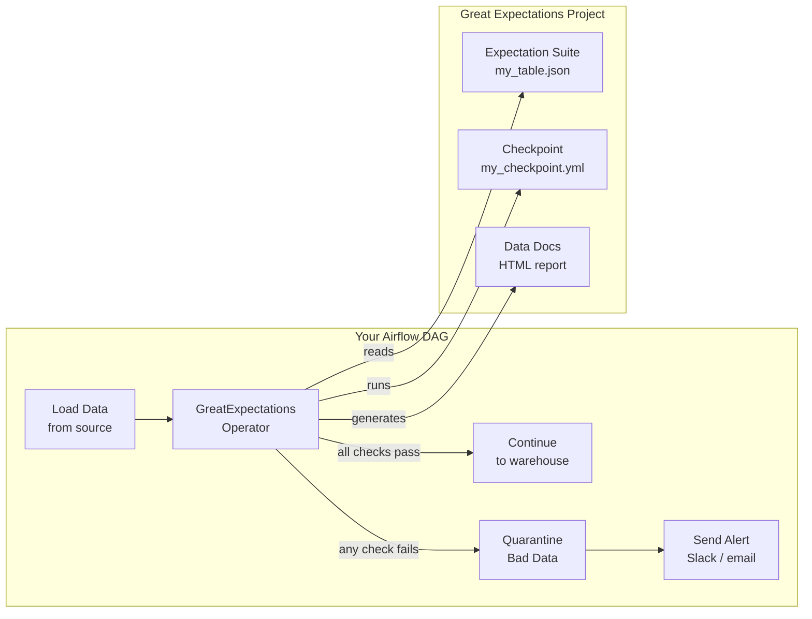

# ✅ Airflow + Great Expectations — Automated Data Quality Gates

> *Great Expectations runs data quality checks. Airflow orchestrates when those checks run. Together you get automated data quality gates in your pipelines — bad data is caught before it reaches your dashboards, warehouses, or ML models.*

---

## 📌 Learning Priority

**Must Learn** — core concepts, needed to understand the rest of this file:
[How It Works](#how-it-works) · [Key Concepts](#key-concepts) · [Using GreatExpectationsOperator in a DAG](#using-greatexpectationsoperator-in-a-dag)

**Should Learn** — important for real projects and interviews:
[Creating an Expectation Suite](#creating-an-expectation-suite) · [Integrating GE into an ETL DAG](#integrating-ge-into-an-etl-dag)

**Good to Know** — useful in specific situations, not needed daily:
[Setup](#setup)

**Reference** — skim once, look up when needed:
[Common Expectations Reference](#common-expectations-reference)

---

## The Story

Your ETL pipeline loads 2 million rows from an API into your data warehouse every day. Most days it works perfectly. But sometimes:
- The API returns nulls in the `user_id` field
- A schema change silently drops the `revenue` column
- Yesterday's data gets re-ingested and creates duplicates
- The API is slow and only delivers 50k rows instead of 2M

By the time your analysts notice something is wrong, the bad data has been used in three reports and a dashboard has been shared with the CEO.

Great Expectations solves this by running automated checks immediately after data loads. Airflow decides what happens next: if checks pass → continue the pipeline; if they fail → quarantine the data and alert the team.

---

## How It Works



---

## Key Concepts

### Expectation Suite
A JSON file defining what your data should look like:
- "Column `user_id` should never be null"
- "Column `revenue` values should be between 0 and 1,000,000"
- "Table should have at least 1,000,000 rows"
- "Schema should have exactly these columns: `[id, user_id, revenue, date]`"

### Checkpoint
Ties an Expectation Suite to a data source. When the checkpoint runs, it validates the suite against your actual data and produces a validation result.

### GreatExpectationsOperator
An Airflow operator from the `great_expectations_provider` package that runs a GE checkpoint and fails/passes the task based on the result.

---

## Setup

```bash
# Install
pip install great_expectations apache-airflow-providers-great-expectations

# Initialize a GE project
great_expectations init

# This creates:
# great_expectations/
# ├── great_expectations.yml     ← datasources, stores, sites config
# ├── expectations/
# │   └── my_suite.json          ← expectation suites
# ├── checkpoints/
# │   └── my_checkpoint.yml      ← checkpoint definitions
# └── uncommitted/               ← auto-generated; don't commit
```

---

## Creating an Expectation Suite

```python
# create_expectations.py — run this once to generate the suite
import great_expectations as gx

context = gx.get_context()

# Add a datasource (Pandas + CSV, or SQL, etc.)
datasource = context.sources.add_or_update_pandas_filesystem(
    name="my_csv_source",
    base_directory="/data/raw/",
)
asset = datasource.add_csv_asset(name="orders", batching_regex=r"orders_(?P<date>\d{8})\.csv")

# Create a suite
suite = context.add_or_update_expectation_suite("orders_suite")

# Add a batch to validate against
batch_request = asset.build_batch_request()
validator = context.get_validator(batch_request=batch_request, expectation_suite_name="orders_suite")

# Define expectations
validator.expect_column_to_exist("order_id")
validator.expect_column_to_exist("user_id")
validator.expect_column_to_exist("revenue")

validator.expect_column_values_to_not_be_null("order_id")
validator.expect_column_values_to_not_be_null("user_id")

validator.expect_column_values_to_be_between("revenue", min_value=0, max_value=1_000_000)

validator.expect_table_row_count_to_be_between(min_value=100_000, max_value=10_000_000)

validator.expect_column_values_to_be_unique("order_id")

# Save the suite
validator.save_expectation_suite(discard_failed_expectations=False)
```

---

## Using GreatExpectationsOperator in a DAG

```python
"""
data_quality_pipeline.py
-------------------------
Loads data, runs Great Expectations validation, branches on result.

Requirements:
  pip install great_expectations apache-airflow-providers-great-expectations
"""

from airflow.sdk import DAG, task
from airflow.operators.python import BranchPythonOperator
from airflow.operators.empty import EmptyOperator
from airflow.operators.bash import BashOperator
from great_expectations_provider.operators.great_expectations import (
    GreatExpectationsOperator,
)
from datetime import datetime
import os

GE_PROJECT_DIR = "/opt/airflow/great_expectations"

with DAG(
    dag_id="data_quality_gate",
    start_date=datetime(2024, 1, 1),
    schedule="@daily",
    catchup=False,
    tags=["data_quality", "great_expectations"],
) as dag:

    # ── Step 1: Load raw data ────────────────────────────────────
    @task
    def load_data(**context):
        """Download and save today's data file."""
        execution_date = context["ds_nodash"]
        # In real life: call an API, save to /data/raw/orders_{date}.csv
        print(f"Loading data for {execution_date}")
        return f"/data/raw/orders_{execution_date}.csv"

    # ── Step 2: Run Great Expectations validation ────────────────
    # This task fails if any expectation fails
    validate_data = GreatExpectationsOperator(
        task_id="validate_data",

        # Where is your GE project?
        data_context_root_dir=GE_PROJECT_DIR,

        # Which checkpoint to run?
        checkpoint_name="orders_checkpoint",

        # Pass runtime variables to the checkpoint
        checkpoint_kwargs={
            "batch_request": {
                "datasource_name": "my_csv_source",
                "data_asset_name": "orders",
                "options": {"date": "{{ ds_nodash }}"},
            }
        },

        # Return the validation result (needed for branching)
        return_json_dict=True,

        # Fail the task if any expectation fails
        # Set to False if you want to handle failures manually
        fail_task_on_validation_failure=False,
    )

    # ── Step 3: Branch based on validation result ────────────────
    def check_validation_result(**context):
        """Check if all expectations passed. Branch accordingly."""
        validation_result = context["ti"].xcom_pull(task_ids="validate_data")

        if validation_result and validation_result.get("success"):
            print("All validations passed!")
            return "load_to_warehouse"
        else:
            # Log which expectations failed
            failed = [
                r for r in validation_result.get("results", [])
                if not r.get("success")
            ]
            print(f"{len(failed)} validations failed:")
            for f in failed:
                print(f"  - {f['expectation_config']['expectation_type']}: {f['result']}")
            return "quarantine_data"

    branch = BranchPythonOperator(
        task_id="check_validation",
        python_callable=check_validation_result,
    )

    # ── Path A: All checks passed → load to warehouse ────────────
    @task
    def load_to_warehouse(**context):
        """Load validated data to the production warehouse."""
        print("Loading clean data to warehouse...")

    # ── Path B: Checks failed → quarantine + alert ───────────────
    @task(trigger_rule="none_failed_min_one_success")
    def quarantine_data(**context):
        """Move bad data to quarantine folder."""
        execution_date = context["ds_nodash"]
        source = f"/data/raw/orders_{execution_date}.csv"
        dest = f"/data/quarantine/orders_{execution_date}.csv"
        os.rename(source, dest)
        print(f"Quarantined: {dest}")

    @task(trigger_rule="none_failed_min_one_success")
    def send_alert(**context):
        """Alert the data team about failed validations."""
        validation_result = context["ti"].xcom_pull(task_ids="validate_data")
        failed_count = sum(
            1 for r in validation_result.get("results", [])
            if not r.get("success")
        )
        print(f"ALERT: {failed_count} data quality checks failed for {context['ds']}")
        # In production: send Slack message, PagerDuty, email, etc.

    # ── Wire everything together ─────────────────────────────────
    loaded = load_data()
    validated = validate_data
    branched = branch

    loaded >> validated >> branched
    branched >> [load_to_warehouse(), quarantine_data()]
    quarantine_data() >> send_alert()
```

---

## Integrating GE into an ETL DAG

A complete ETL pipeline with GE quality gates at the right places:

```python
from airflow.sdk import DAG, task
from great_expectations_provider.operators.great_expectations import GreatExpectationsOperator
from datetime import datetime

with DAG(
    dag_id="etl_with_quality_gates",
    start_date=datetime(2024, 1, 1),
    schedule="@daily",
    catchup=False,
) as dag:

    @task
    def extract(): ...

    # Quality gate 1: check the raw data before transforming
    validate_raw = GreatExpectationsOperator(
        task_id="validate_raw",
        data_context_root_dir="/opt/airflow/great_expectations",
        checkpoint_name="raw_data_checkpoint",
        fail_task_on_validation_failure=True,
    )

    @task
    def transform(): ...

    # Quality gate 2: check the transformed data before loading
    validate_transformed = GreatExpectationsOperator(
        task_id="validate_transformed",
        data_context_root_dir="/opt/airflow/great_expectations",
        checkpoint_name="transformed_data_checkpoint",
        fail_task_on_validation_failure=True,
    )

    @task
    def load(): ...

    extract() >> validate_raw >> transform() >> validate_transformed >> load()
```

---

## Common Expectations Reference

```python
# Null checks
validator.expect_column_values_to_not_be_null("user_id")

# Uniqueness
validator.expect_column_values_to_be_unique("order_id")

# Value ranges
validator.expect_column_values_to_be_between("revenue", min_value=0, max_value=1e6)
validator.expect_column_values_to_be_in_set("status", ["pending", "completed", "cancelled"])

# Schema
validator.expect_column_to_exist("revenue")
validator.expect_table_columns_to_match_ordered_list(["id", "user_id", "revenue", "date"])

# Row count
validator.expect_table_row_count_to_be_between(min_value=1_000, max_value=None)

# Data types
validator.expect_column_values_to_be_of_type("order_id", "int64")
validator.expect_column_values_to_match_regex("email", r"[^@]+@[^@]+\.[^@]+")

# Freshness (check the max date is recent)
validator.expect_column_max_to_be_between(
    "order_date",
    min_value="2024-01-01",
    max_value=None,
)
```

---

## See Also

- [KubernetesPodOperator →](../44_KubernetesPodOperator_Deep_Dive/Theory.md) — Run GE in an isolated pod
- [dbt Integration →](../41_dbt_Integration/Theory.md) — Combine GE input validation with dbt transform
