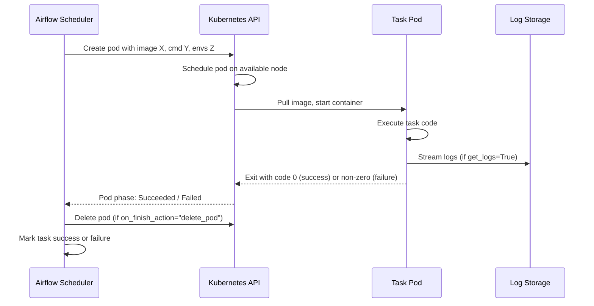
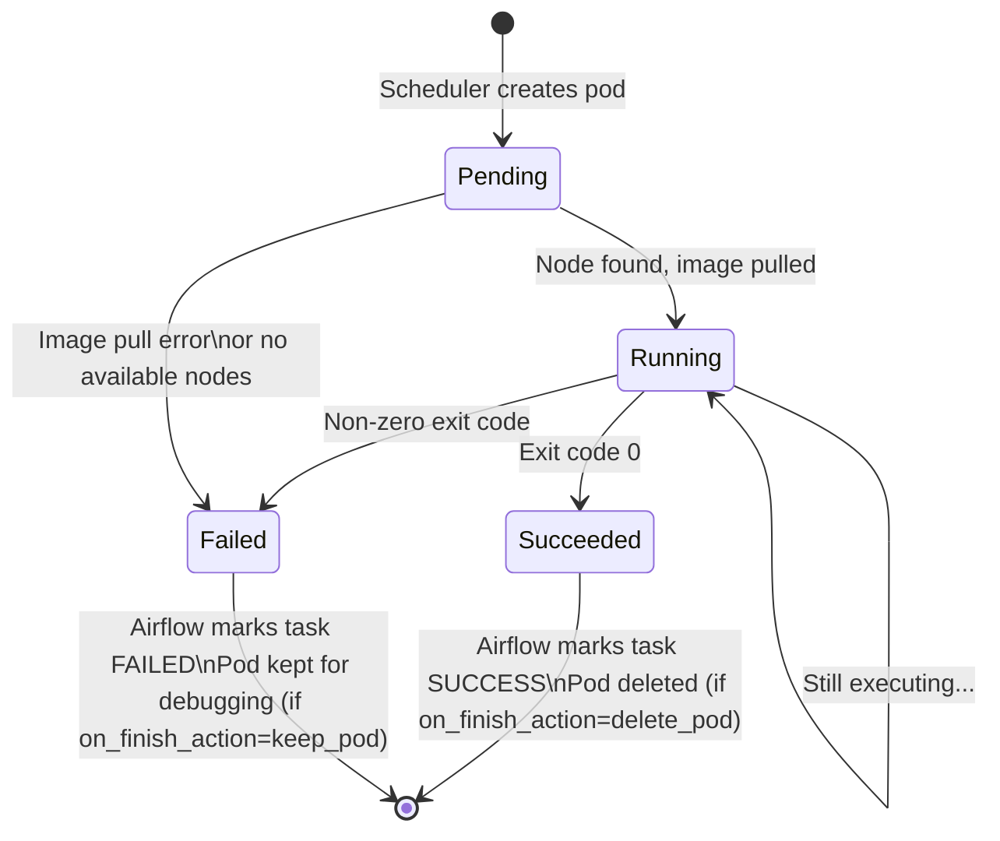

# 🐳 KubernetesPodOperator — Deep Dive

> *KubernetesPodOperator is the most flexible operator in Airflow — run any code, any language, any version in its own isolated Kubernetes pod. It's the escape hatch for everything Airflow can't do natively. Your task needs Node.js? A specific Python version? 128GB of RAM? A GPU? KPO handles all of it.*

---

## The Story

You have a machine learning team. Their training script is in PyTorch. It needs Python 3.11, CUDA drivers, and 64GB of RAM. Your Airflow workers run Python 3.9 with 8GB of RAM.

You could install everything on the workers. But that makes your workers fragile — one incompatible package breaks every other task. You could build a custom Airflow image. But then every change to the ML dependencies requires rebuilding and redeploying Airflow.

KubernetesPodOperator solves this cleanly. Each task runs in its own Kubernetes pod with its own Docker image. The ML task runs in `pytorch/pytorch:2.0-cuda11`. The dbt task runs in `ghcr.io/dbt-labs/dbt-postgres:1.7`. The Go report generator runs in `golang:1.21`. None of them affect each other or the Airflow workers.

When the task finishes, the pod disappears. Clean, isolated, reproducible.

---

## How KPO Works



---

## Full Parameter Reference

```python
from airflow.providers.cncf.kubernetes.operators.pod import KubernetesPodOperator
from kubernetes.client import models as k8s

run_ml_training = KubernetesPodOperator(
    task_id="train_model",

    # ── Container image ──────────────────────────────────────────
    image="pytorch/pytorch:2.0-cuda11.7-cudnn8-runtime",

    # Image pull policy:
    # "Always" — pull even if image exists locally (use for :latest tags)
    # "IfNotPresent" — pull only if not in local registry (use for versioned tags)
    # "Never" — use only locally cached image
    image_pull_policy="IfNotPresent",

    # For private registries, create a K8s secret first:
    #   kubectl create secret docker-registry regcred \
    #     --docker-server=... --docker-username=... --docker-password=...
    image_pull_secrets=[k8s.V1LocalObjectReference(name="regcred")],

    # ── Command and arguments ────────────────────────────────────
    # cmds: overrides ENTRYPOINT in the Dockerfile
    # arguments: passed as CMD (or to the entrypoint as args)
    cmds=["python"],
    arguments=[
        "/app/train.py",
        "--epochs", "50",
        "--learning-rate", "0.001",
        "--output-dir", "/tmp/model_output",
    ],

    # ── Naming ───────────────────────────────────────────────────
    name="train-model",             # pod name prefix
    namespace="airflow",            # which k8s namespace to create the pod in

    # ── Pod lifecycle ────────────────────────────────────────────
    # What happens to the pod after it finishes:
    # "delete_pod" — delete immediately (production default, saves resources)
    # "keep_pod" — keep for debugging (useful in development)
    on_finish_action="delete_pod",

    # How long to wait for the pod to start before giving up (seconds)
    startup_timeout_seconds=300,

    # Whether Airflow is running inside the same K8s cluster
    # True: use in-cluster config (most common)
    # False: use a kubeconfig file (for external K8s clusters)
    in_cluster=True,

    # ── Environment variables ────────────────────────────────────
    env_vars={
        "BATCH_DATE": "{{ ds }}",
        "MODEL_VERSION": "v2",
        "MLFLOW_TRACKING_URI": "http://mlflow:5000",
    },

    # ── Secrets as environment variables ─────────────────────────
    # Read from Kubernetes secrets (never hardcode credentials)
    secrets=[
        k8s.V1EnvVar(
            name="DB_PASSWORD",
            value_from=k8s.V1EnvVarSource(
                secret_key_ref=k8s.V1SecretKeySelector(
                    name="db-credentials",      # K8s secret name
                    key="password",             # key inside the secret
                )
            ),
        ),
        k8s.V1EnvVar(
            name="AWS_ACCESS_KEY_ID",
            value_from=k8s.V1EnvVarSource(
                secret_key_ref=k8s.V1SecretKeySelector(
                    name="aws-credentials",
                    key="access_key_id",
                )
            ),
        ),
    ],

    # ── Resource requests and limits ─────────────────────────────
    # Requests: minimum resources guaranteed to the pod
    # Limits: maximum resources the pod can use
    container_resources=k8s.V1ResourceRequirements(
        requests={
            "cpu": "2000m",         # 2 CPU cores
            "memory": "8Gi",        # 8 GB RAM
            "nvidia.com/gpu": "1",  # 1 GPU (if node has GPUs)
        },
        limits={
            "cpu": "4000m",
            "memory": "16Gi",
            "nvidia.com/gpu": "1",
        },
    ),

    # ── Volume mounts ────────────────────────────────────────────
    # Attach storage to the pod
    volumes=[
        # Shared config volume from a ConfigMap
        k8s.V1Volume(
            name="model-config",
            config_map=k8s.V1ConfigMapVolumeSource(name="model-config"),
        ),
        # Persistent storage for model output
        k8s.V1Volume(
            name="model-output",
            persistent_volume_claim=k8s.V1PersistentVolumeClaimVolumeSource(
                claim_name="model-output-pvc",
            ),
        ),
        # Empty dir for temporary scratch space
        k8s.V1Volume(
            name="tmp-dir",
            empty_dir=k8s.V1EmptyDirVolumeSource(medium=""),
        ),
    ],
    volume_mounts=[
        k8s.V1VolumeMount(
            name="model-config",
            mount_path="/app/config",
            read_only=True,
        ),
        k8s.V1VolumeMount(
            name="model-output",
            mount_path="/tmp/model_output",
        ),
        k8s.V1VolumeMount(
            name="tmp-dir",
            mount_path="/tmp",
        ),
    ],

    # ── Logging ──────────────────────────────────────────────────
    # Stream pod logs to Airflow task logs in real time
    get_logs=True,

    # Log everything (True) or just stderr (False)
    log_events_on_failure=True,

    # ── XCom ─────────────────────────────────────────────────────
    # If True, reads /airflow/xcom/return.json from the pod
    # and pushes it as this task's XCom return value
    do_xcom_push=True,

    # ── Node selection ───────────────────────────────────────────
    # Run only on nodes with specific labels (e.g., GPU nodes)
    node_selector={"cloud.google.com/gke-nodepool": "gpu-pool"},

    # ── Tolerations ──────────────────────────────────────────────
    # Allow scheduling on tainted nodes (e.g., spot/preemptible instances)
    tolerations=[
        k8s.V1Toleration(
            key="nvidia.com/gpu",
            operator="Exists",
            effect="NoSchedule",
        ),
    ],

    # ── Labels ───────────────────────────────────────────────────
    labels={
        "team": "ml",
        "cost-center": "research",
    },

    # ── Service account ──────────────────────────────────────────
    # Use a specific K8s service account (for IRSA/Workload Identity)
    service_account_name="ml-worker-sa",

    # ── Pod annotations ──────────────────────────────────────────
    annotations={
        "iam.amazonaws.com/role": "arn:aws:iam::123456789:role/ml-training-role",
    },
)
```

---

## XCom with KubernetesPodOperator

To pass data from a KPO task to the next task, write a JSON file inside the pod at exactly `/airflow/xcom/return.json`:

```python
# In your container script (train.py):
import json
import os

# Your task code
results = {
    "accuracy": 0.94,
    "loss": 0.082,
    "model_path": "s3://models/v2/2024-01-15/model.pkl",
    "training_time_seconds": 847,
}

# Write results for Airflow to pick up
os.makedirs("/airflow/xcom", exist_ok=True)
with open("/airflow/xcom/return.json", "w") as f:
    json.dump(results, f)
```

In your Airflow DAG, read the XCom from the next task:

```python
from airflow.sdk import DAG, task
from airflow.providers.cncf.kubernetes.operators.pod import KubernetesPodOperator

with DAG("kpo_xcom_example", ...) as dag:

    train = KubernetesPodOperator(
        task_id="train_model",
        image="my-training-image:latest",
        cmds=["python", "/app/train.py"],
        do_xcom_push=True,          # read /airflow/xcom/return.json
        # ... other params
    )

    @task
    def evaluate_results(**context):
        # Get the training results from the KPO task
        metrics = context["ti"].xcom_pull(task_ids="train_model")
        print(f"Accuracy: {metrics['accuracy']}")
        print(f"Model path: {metrics['model_path']}")

        if metrics["accuracy"] < 0.90:
            raise ValueError(f"Model accuracy {metrics['accuracy']} below threshold 0.90")

        return metrics["model_path"]

    train >> evaluate_results()
```

---

## Using a Pod Template File

For complex pod specs, define them in a YAML template instead of Python code:

```yaml
# pod_template.yaml — stored in your DAGs folder or ConfigMap
apiVersion: v1
kind: Pod
metadata:
  name: placeholder
  labels:
    team: ml
spec:
  serviceAccountName: ml-worker-sa
  nodeSelector:
    cloud.google.com/gke-nodepool: gpu-pool
  tolerations:
    - key: nvidia.com/gpu
      operator: Exists
      effect: NoSchedule
  containers:
    - name: base
      image: placeholder
      resources:
        requests:
          nvidia.com/gpu: "1"
          memory: "16Gi"
        limits:
          nvidia.com/gpu: "1"
          memory: "32Gi"
```

```python
train = KubernetesPodOperator(
    task_id="train_model",
    image="pytorch/pytorch:2.0-cuda11",
    cmds=["python", "/app/train.py"],
    pod_template_file="/opt/airflow/pod_templates/gpu_pod.yaml",
    # Settings in this operator override the template
)
```

---

## Pod Lifecycle Diagram



---

## Resource Management Best Practices

| Concern | Recommendation |
|---------|---------------|
| Always set resource requests | Without requests, pod may be scheduled on overloaded node |
| Match requests to actual usage | Over-requesting wastes cluster capacity |
| Set limits slightly above requests | Prevents runaway tasks from consuming all node memory |
| Use `emptyDir` for temp files | Don't write to the container filesystem layer |
| Use node selectors for GPU tasks | Prevent GPU pods landing on CPU-only nodes |
| Use spot/preemptible tolerations | 70–80% cost savings on non-critical tasks |
| Set `startup_timeout_seconds` | Prevent hung pods waiting indefinitely for resources |

---

## Common Patterns

### Pattern 1: Run any Python version

```python
# Run a script that requires Python 3.12 on Airflow 3.9 workers
task = KubernetesPodOperator(
    task_id="python312_task",
    image="python:3.12-slim",
    cmds=["python", "-c"],
    arguments=["import sys; print(sys.version)"],
)
```

### Pattern 2: Run a non-Python task

```python
# Run a Rust binary, Go script, or any compiled program
task = KubernetesPodOperator(
    task_id="rust_report",
    image="gcr.io/my-org/rust-report-generator:v1.2",
    arguments=["--date", "{{ ds }}", "--output", "s3://reports/{{ ds }}.pdf"],
)
```

### Pattern 3: Data processing with large memory

```python
# Process large dataset that needs 256GB RAM
task = KubernetesPodOperator(
    task_id="large_pandas_job",
    image="my-pandas-image:latest",
    container_resources=k8s.V1ResourceRequirements(
        requests={"memory": "256Gi", "cpu": "16"},
        limits={"memory": "256Gi", "cpu": "32"},
    ),
    node_selector={"node.kubernetes.io/instance-type": "r5.16xlarge"},
)
```

---

## See Also

- [ML Training Pipeline →](../../08_Projects/03_Advanced_Projects/05_ML_Training_Pipeline/Project_Guide.md) — Full project using KPO
- [Dynamic Task Mapping](../../03_Advanced/16_Dynamic_Mapping/Theory.md) — Combine KPO with `expand()` for parallel pod tasks
