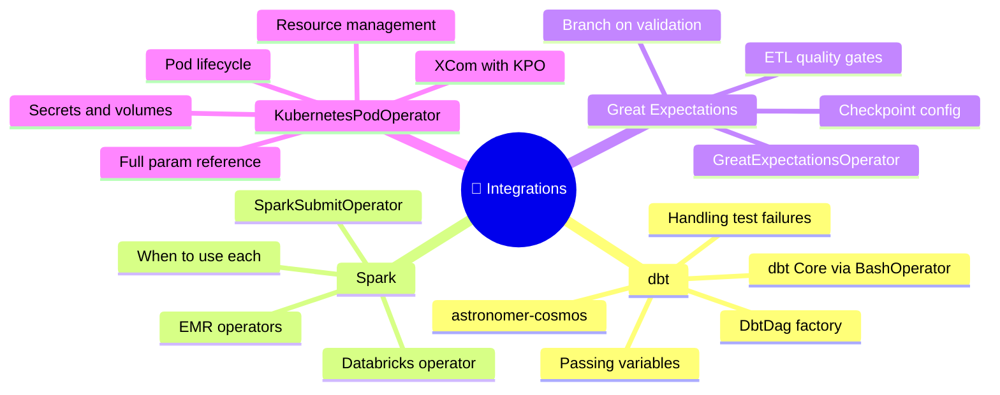
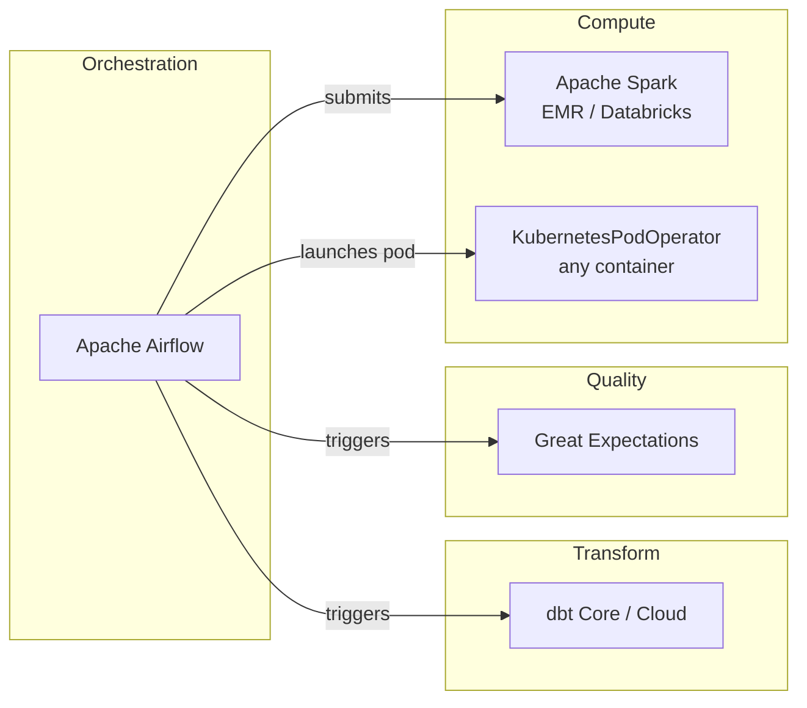

⬅️ [Airflow on Cloud](../06_Airflow_on_Cloud/Readme.md) &nbsp;|&nbsp; 🏠 [Home](../00_Learning_Guide/Readme.md) &nbsp;|&nbsp; [Projects ➡️](../08_Projects/Readme.md)

---

# 🔗 Integrations

> *Airflow doesn't transform data, train models, or run quality checks — it orchestrates the tools that do. This section covers the most important integrations in the modern data stack.*

**[Start Here → dbt Integration (Theory.md)](41_dbt_Integration/Theory.md)**

---

## At a Glance

| | |
|---|---|
| **Topics** | 4 modules |
| **Est. Time** | 8–10 hours |
| **Prerequisites** | 🔴 Advanced Track complete |
| **Unlocks** | 🛠️ Projects |

---

## Section Map

---

## Topics

| Module | File | Description |
|--------|------|-------------|
| 41 | [dbt Integration → Theory.md](41_dbt_Integration/Theory.md) | Airflow + dbt Core and dbt Cloud patterns |
| 41 | [dbt Integration → Code Example](41_dbt_Integration/Code_Example.md) | BashOperator dbt run + cosmos DbtDag |
| 42 | [Spark Integration → Theory.md](42_Spark_Integration/Theory.md) | SparkSubmit, EMR, Databricks from Airflow |
| 43 | [Great Expectations → Theory.md](43_Great_Expectations/Theory.md) | Data quality gates with GE operator |
| 44 | [KubernetesPodOperator → Theory.md](44_KubernetesPodOperator_Deep_Dive/Theory.md) | Complete KPO parameter reference |

---

## The Modern Data Stack

---

## Before You Start

- Advanced Track complete (especially Dynamic Task Mapping and Callbacks)
- For dbt: have dbt Core installed (`pip install dbt-core dbt-postgres`)
- For Spark: access to either a local Spark install, AWS EMR, or Databricks account
- For KPO: a running Kubernetes cluster (Docker Desktop with k8s enabled works)

---

⬅️ [Airflow on Cloud](../06_Airflow_on_Cloud/Readme.md) &nbsp;|&nbsp; 🏠 [Home](../00_Learning_Guide/Readme.md) &nbsp;|&nbsp; [Projects ➡️](../08_Projects/Readme.md)

