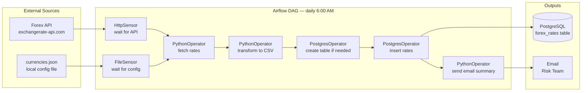

# 🟢 Project 01 — Forex ETL Pipeline

> **Level:** Beginner | **Est. Time:** 2–3 hours | **Skills:** HttpSensor, PythonOperator, PostgresOperator, BashOperator, Email

---

## The Story

You've just joined a fintech startup as their first data engineer. The risk team manually checks exchange rates every morning and enters them into a spreadsheet. It takes 30 minutes and they sometimes get the data wrong.

Your first task: automate it. Build a pipeline that fetches live forex rates from a public API every morning, stores them in PostgreSQL, and emails the risk team a summary. When you're done, their morning routine drops from 30 minutes to zero.

This is a classic ETL pipeline — Extract from API, Transform the data, Load to database.

---

## Architecture



---

## Prerequisites

| Requirement | Why |
|-------------|-----|
| Airflow 3 running locally | The runtime environment |
| Docker Desktop | Run PostgreSQL locally |
| `apache-airflow-providers-http` | HttpSensor + HttpHook |
| `apache-airflow-providers-postgres` | PostgresOperator + PostgresHook |
| Free API key from exchangerate-api.com | Get forex data |

**Set up PostgreSQL with Docker:**
```bash
docker run -d \
  --name forex-postgres \
  -e POSTGRES_USER=airflow \
  -e POSTGRES_PASSWORD=airflow \
  -e POSTGRES_DB=forex \
  -p 5432:5432 \
  postgres:15
```

---

## Setup Steps

### Step 1 — Install providers
```bash
pip install apache-airflow-providers-http apache-airflow-providers-postgres
```

### Step 2 — Create Airflow connections
```bash
# Forex API connection
airflow connections add 'forex_api' \
  --conn-type 'http' \
  --conn-host 'https://v6.exchangerate-api.com'

# PostgreSQL connection
airflow connections add 'forex_postgres' \
  --conn-type 'postgres' \
  --conn-host 'localhost' \
  --conn-login 'airflow' \
  --conn-password 'airflow' \
  --conn-schema 'forex' \
  --conn-port 5432
```

### Step 3 — Create the currencies config file
```bash
mkdir -p /tmp/forex
cat > /tmp/forex/currencies.json << 'EOF'
{
  "base": "USD",
  "currencies": ["EUR", "GBP", "JPY", "AUD", "CAD", "CHF", "CNY"]
}
EOF
```

### Step 4 — Get a free API key
Sign up at [exchangerate-api.com](https://www.exchangerate-api.com/) (free tier: 1,500 requests/month).

### Step 5 — Add the DAG and trigger it
```bash
cp forex_etl_pipeline.py ~/airflow/dags/
airflow dags trigger forex_etl_pipeline
```

---

## What You'll Learn

By building this project, you'll practice:

| Skill | Where it appears |
|-------|-----------------|
| HttpSensor | Polling an API endpoint before proceeding |
| FileSensor | Waiting for a config file to exist |
| PythonOperator | Fetching and transforming data in Python |
| XCom | Passing data between tasks (rates → CSV task) |
| PostgresOperator | Running SQL to create tables and insert data |
| BashOperator | Moving/cleaning up files |
| Email notification | Alerting stakeholders on success |
| DAG scheduling | Running at 6am daily with `schedule="0 6 * * *"` |

---

## Expected Output

After a successful run:

**PostgreSQL table `forex_rates`:**
```
 id | base_currency | target_currency | rate   | fetched_at
----+---------------+-----------------+--------+----------------------------
  1 | USD           | EUR             | 0.9234 | 2024-01-15 06:01:23.456789
  2 | USD           | GBP             | 0.7891 | 2024-01-15 06:01:23.456789
  3 | USD           | JPY             | 148.45 | 2024-01-15 06:01:23.456789
  ...
```

**Email summary:**
```
Subject: Forex Rates Loaded — 2024-01-15

Forex ETL pipeline completed successfully.

Base currency: USD
Rates loaded: 7
Execution time: 2024-01-15 06:01:15 UTC

Rates:
  USD/EUR: 0.9234
  USD/GBP: 0.7891
  USD/JPY: 148.45
  USD/AUD: 1.5234
  USD/CAD: 1.3456
  USD/CHF: 0.8901
  USD/CNY: 7.2145
```

---

## Extension Challenges

Once you've got the basic pipeline working, try these:

1. **Add a retry mechanism** — configure `retries=3, retry_delay=timedelta(minutes=5)` on the API fetch task
2. **Add a data freshness check** — use a `ShortCircuitOperator` to skip the run if rates were already loaded today
3. **Historical backfill** — enable `catchup=True` and run the pipeline for the past 7 days
4. **Add a dashboard** — query the table and generate a Matplotlib chart in the email

---

## See Also

- [Code Example →](./Code_Example.md) — Complete, well-commented DAG code
- [CSV File Processing →](../02_Simple_File_Processing/Project_Guide.md) — Next beginner project
