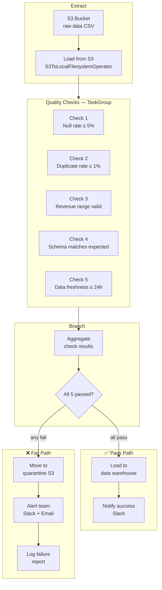

# 🟡 Project 03 — Data Quality Gate Pipeline

> **Level:** Intermediate | **Est. Time:** 3–4 hours | **Skills:** S3 operators, BranchPythonOperator, XCom, TaskGroup, callbacks

---

## The Story

You're a senior data engineer. Last month, the analytics team's weekly revenue report was wrong because a null `customer_id` slipped through your ETL. It took three days to find the bug. The business lost trust in the numbers.

Your manager says: *"We need automated data quality checks before anything reaches the warehouse. If data is bad, quarantine it and alert us immediately."*

You build a pipeline with five automated quality checks. If all five pass, the data flows to the warehouse. If any fail, the bad data goes to a quarantine bucket and the team gets a Slack alert within minutes — before anyone runs a bad report.

---

## Architecture



---

## The Five Quality Checks

| Check | Logic | Threshold | On Failure |
|-------|-------|-----------|-----------|
| 1. Null rate | `% of null values in critical columns` | ≤ 5% | Quarantine + alert |
| 2. Duplicate rate | `% of duplicate primary keys` | ≤ 1% | Quarantine + alert |
| 3. Range validation | `revenue between $0 and $1,000,000` | 100% within range | Quarantine + alert |
| 4. Schema check | `columns match expected schema exactly` | Exact match | Quarantine + alert |
| 5. Data freshness | `max(event_timestamp) within last 24h` | ≤ 24 hours ago | Quarantine + alert |

---

## Prerequisites

| Requirement | Why |
|-------------|-----|
| Airflow 3 running | Runtime |
| AWS account with S3 bucket | Data source + quarantine destination |
| `apache-airflow-providers-amazon` | S3 operators |
| Slack webhook URL | Alerts |

```bash
pip install apache-airflow-providers-amazon
```

---

## Setup

### Airflow connections needed:
```bash
# AWS connection (for S3)
airflow connections add 'aws_default' \
  --conn-type 'amazon_web_services' \
  --conn-login 'YOUR_ACCESS_KEY_ID' \
  --conn-password 'YOUR_SECRET_ACCESS_KEY' \
  --conn-extra '{"region_name": "us-east-1"}'

# Slack webhook
airflow connections add 'slack_default' \
  --conn-type 'http' \
  --conn-host 'https://hooks.slack.com' \
  --conn-password '/services/YOUR/WEBHOOK/TOKEN'
```

### Airflow variables:
```bash
airflow variables set raw_data_bucket "your-raw-data-bucket"
airflow variables set quarantine_bucket "your-quarantine-bucket"
airflow variables set warehouse_schema "analytics"
```

---

## Key Code Patterns

### TaskGroup for Quality Checks

```python
from airflow.utils.task_group import TaskGroup

with TaskGroup("quality_checks") as quality_group:
    check_nulls = PythonOperator(...)
    check_duplicates = PythonOperator(...)
    check_ranges = PythonOperator(...)
    check_schema = PythonOperator(...)
    check_freshness = PythonOperator(...)
```

All 5 checks run in parallel inside the group, then the aggregate task collects their results.

### XCom for check results

Each check pushes its result:
```python
context["ti"].xcom_push(key="null_check", value={"passed": True, "null_rate": 0.02})
```

The aggregate task pulls all results:
```python
null_result = ti.xcom_pull(task_ids="quality_checks.check_nulls", key="null_check")
dup_result  = ti.xcom_pull(task_ids="quality_checks.check_duplicates", key="dup_check")
# ... etc
all_passed = all([
    null_result["passed"],
    dup_result["passed"],
    range_result["passed"],
    schema_result["passed"],
    freshness_result["passed"],
])
```

### on_failure_callback for immediate alerting

```python
def alert_on_failure(context):
    """Called automatically when any task fails."""
    dag_id = context["dag"].dag_id
    task_id = context["task"].task_id
    execution_date = context["execution_date"]
    error = context.get("exception")
    # Send Slack/PagerDuty here

with DAG(
    dag_id="data_quality_gate",
    on_failure_callback=alert_on_failure,  # fires on any task failure
    ...
)
```

---

## What You'll Learn

| Skill | Where it appears |
|-------|-----------------|
| S3ToLocalFilesystemOperator | Downloading files from S3 |
| TaskGroup | Grouping parallel quality check tasks |
| XCom with task groups | Pulling from `task_group.task_name` key format |
| BranchPythonOperator | Routing to pass/fail paths |
| on_failure_callback | Alerting on task failure |
| trigger_rule | Making cleanup tasks run after either branch |
| S3CopyObjectOperator | Copying file to quarantine bucket |

---

## Expected Output on Pass

```
Task: load_from_s3              → SUCCESS
Task Group: quality_checks
  ├── check_nulls               → SUCCESS (null rate: 1.2%)
  ├── check_duplicates          → SUCCESS (dup rate: 0.0%)
  ├── check_ranges              → SUCCESS (100% within range)
  ├── check_schema              → SUCCESS (all 8 columns present)
  └── check_freshness           → SUCCESS (max date: 3h ago)
Task: aggregate_results         → SUCCESS (5/5 passed)
Task: branch                    → routes to "load_to_warehouse"
Task: load_to_warehouse         → SUCCESS
Task: notify_success            → SUCCESS

Slack message: ✅ Data quality checks passed — 1,234,567 rows loaded
```

## Expected Output on Fail

```
Task Group: quality_checks
  ├── check_nulls               → SUCCESS (null rate: 1.2%)
  ├── check_duplicates          → FAILED  (dup rate: 8.3% — exceeds 1%)
  ├── check_ranges              → SUCCESS
  ├── check_schema              → SUCCESS
  └── check_freshness           → SUCCESS
Task: aggregate_results         → 4/5 passed — ROUTING TO QUARANTINE
Task: quarantine_file           → SUCCESS (moved to s3://quarantine/...)
Task: send_alert                → SUCCESS

Slack message: 🔴 Data quality FAILED — 2024-01-15 run
  ❌ check_duplicates: dup_rate=8.3% exceeds threshold 1%
  File quarantined: s3://quarantine/raw/2024-01-15.csv
```

---

## Extension Challenges

1. **Add a data diff check** — compare row count to yesterday's run (±20% tolerance)
2. **Generate a quality report** — write the XCom results to an HTML report and email it
3. **Re-run failed checks** — add a sensor that waits for a vendor to re-upload a fixed file
4. **Add Great Expectations** — replace the custom checks with a GE checkpoint (see [GE Integration](../../../07_Integrations/43_Great_Expectations/Theory.md))

---

## See Also

- [Multi-Source ETL →](../04_Multi_Source_ETL/Project_Guide.md) — Next intermediate project
- [Great Expectations →](../../../07_Integrations/43_Great_Expectations/Theory.md) — Production-grade quality checks
