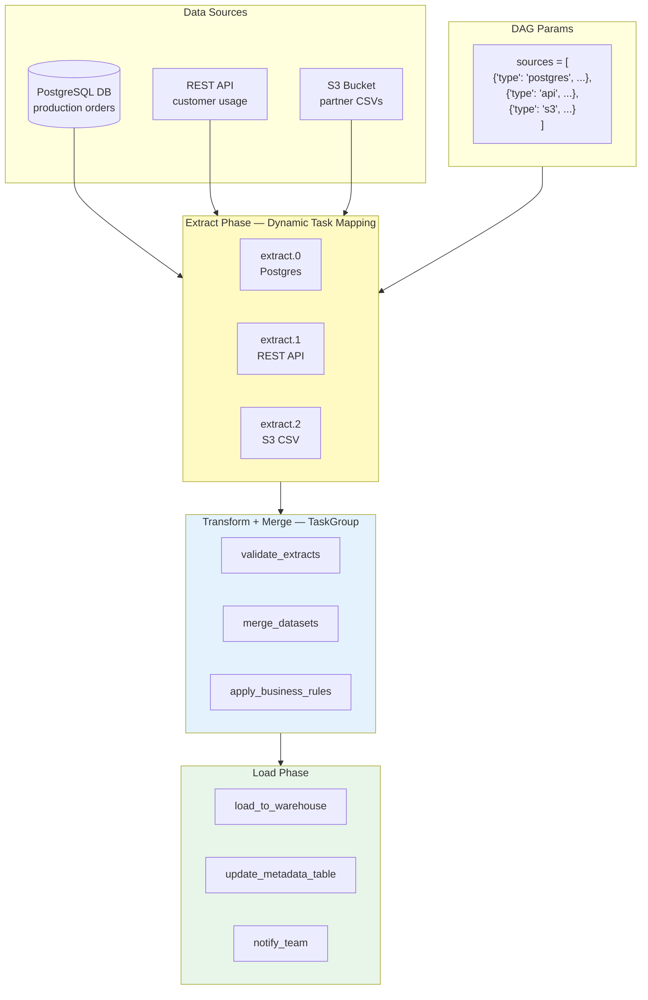

# 🟡 Project 04 — Multi-Source ETL Pipeline

> **Level:** Intermediate | **Est. Time:** 4–5 hours | **Skills:** Dynamic Task Mapping, XCom, TaskGroup, Pools, concurrency control

---

## The Story

You work at a SaaS company. The data warehouse needs daily snapshots from three completely different sources: the production PostgreSQL database, a third-party REST API with customer usage data, and a partner S3 bucket with CSV files.

The three extracts are independent — they can run in parallel. But the merge and load must happen only after all three finish successfully.

Previously this was three separate DAGs that someone triggered manually in order. Your job: build one unified pipeline that extracts all three in parallel using Dynamic Task Mapping, merges the results, and loads to the warehouse — with proper resource controls so the pipeline doesn't overwhelm your systems.

---

## Architecture



---

## Key Concept: Dynamic Task Mapping

The core of this project is `expand()`. Instead of hard-coding three extract tasks, you define one extract function and dynamically create one task instance per source:

```python
sources = [
    {"type": "postgres", "connection": "prod_postgres", "query": "SELECT ..."},
    {"type": "api",      "base_url": "https://api.example.com", "endpoint": "/usage"},
    {"type": "s3",       "bucket": "partner-data", "prefix": "daily/"},
]

extract = PythonOperator.partial(
    task_id="extract",
    python_callable=extract_from_source,
).expand(op_kwargs=sources)
# Creates: extract[0], extract[1], extract[2]
# All run in parallel
```

If you later add a 4th source, just add it to the list — no DAG code change needed.

---

## The Three Extractors

### Extractor 1 — PostgreSQL

```python
def extract_postgres(connection: str, query: str, **context) -> str:
    """Extract from PostgreSQL and save to parquet."""
    from airflow.providers.postgres.hooks.postgres import PostgresHook
    import pandas as pd

    hook = PostgresHook(postgres_conn_id=connection)
    df = hook.get_pandas_df(sql=query.format(ds=context["ds"]))

    output_path = f"/tmp/extract_postgres_{context['ds_nodash']}.parquet"
    df.to_parquet(output_path, index=False)

    return {"source": "postgres", "path": output_path, "rows": len(df)}
```

### Extractor 2 — REST API

```python
def extract_api(base_url: str, endpoint: str, **context) -> str:
    """Extract from REST API with pagination."""
    import requests
    import pandas as pd

    all_records = []
    page = 1

    while True:
        response = requests.get(
            f"{base_url}{endpoint}",
            params={"date": context["ds"], "page": page, "limit": 1000},
            headers={"Authorization": f"Bearer {os.environ['API_TOKEN']}"},
        )
        data = response.json()
        records = data.get("data", [])
        if not records:
            break
        all_records.extend(records)
        page += 1

    df = pd.DataFrame(all_records)
    output_path = f"/tmp/extract_api_{context['ds_nodash']}.parquet"
    df.to_parquet(output_path, index=False)

    return {"source": "api", "path": output_path, "rows": len(df)}
```

### Extractor 3 — S3 CSV

```python
def extract_s3(bucket: str, prefix: str, **context) -> str:
    """Download and read CSVs from S3."""
    from airflow.providers.amazon.aws.hooks.s3 import S3Hook
    import pandas as pd

    hook = S3Hook(aws_conn_id="aws_default")
    keys = hook.list_keys(bucket_name=bucket, prefix=f"{prefix}{context['ds']}/")

    dfs = []
    for key in keys:
        local_path = f"/tmp/{Path(key).name}"
        hook.download_file(bucket_name=bucket, key=key, local_path=local_path)
        dfs.append(pd.read_csv(local_path))

    df = pd.concat(dfs, ignore_index=True)
    output_path = f"/tmp/extract_s3_{context['ds_nodash']}.parquet"
    df.to_parquet(output_path, index=False)

    return {"source": "s3", "path": output_path, "rows": len(df)}
```

---

## Pools for Resource Management

With three parallel extracts, you might overwhelm your PostgreSQL primary. Use Pools to limit concurrency:

```bash
# Create a pool that limits DB connections
airflow pools set db_extract_pool 2 "Limits concurrent DB extract tasks"

# Create a pool for API calls
airflow pools set api_pool 3 "Limits concurrent API calls"
```

Assign tasks to pools:
```python
extract = PythonOperator.partial(
    task_id="extract",
    python_callable=extract_from_source,
    pool="db_extract_pool",     # max 2 concurrent
).expand(op_kwargs=sources)
```

---

## Merging XCom Results from Mapped Tasks

When `expand()` creates multiple task instances, XCom returns a list:

```python
def merge_datasets(**context):
    """Collect results from all extract tasks and merge."""
    import pandas as pd

    # xcom_pull on a mapped task returns a list
    # Index 0 = extract[0] result, Index 1 = extract[1], etc.
    extract_results = context["ti"].xcom_pull(task_ids="extract")
    # extract_results = [
    #     {"source": "postgres", "path": "/tmp/extract_postgres_...parquet", "rows": 50000},
    #     {"source": "api",      "path": "/tmp/extract_api_...parquet",      "rows": 31200},
    #     {"source": "s3",       "path": "/tmp/extract_s3_...parquet",       "rows": 8900},
    # ]

    dfs = []
    for result in extract_results:
        df = pd.read_parquet(result["path"])
        df["_source"] = result["source"]   # add source column for lineage
        dfs.append(df)

    merged = pd.concat(dfs, ignore_index=True)
    print(f"Total rows after merge: {len(merged)}")
    return merged
```

---

## What You'll Learn

| Skill | Where it appears |
|-------|-----------------|
| `expand()` (Dynamic Task Mapping) | Creating N extract tasks from a list of N configs |
| XCom with mapped tasks | Collecting results from all expand() instances |
| TaskGroup | Grouping the transform tasks for clean UI |
| Pools | Limiting DB and API concurrency |
| `partial()` + `expand()` pattern | Passing fixed args + dynamic args to mapped tasks |
| `all_success` trigger rule | Ensuring merge only runs if all extracts succeeded |

---

## Expected Output

```
Task: extract[0] (postgres)    → SUCCESS — 50,000 rows extracted
Task: extract[1] (api)         → SUCCESS — 31,200 rows extracted
Task: extract[2] (s3)          → SUCCESS — 8,900 rows extracted

TaskGroup: transform
  ├── validate_extracts         → SUCCESS — 3/3 sources valid
  ├── merge_datasets            → SUCCESS — 90,100 rows merged
  └── apply_business_rules      → SUCCESS — 87,432 rows after dedup

Task: load_to_warehouse         → SUCCESS — 87,432 rows loaded
Task: update_metadata           → SUCCESS
Task: notify_team               → SUCCESS

Total pipeline duration: 8 minutes
```

---

## Extension Challenges

1. **Add a 4th source** — add a new dict to the `sources` list; the DAG auto-adapts
2. **Parallel loads** — use `expand()` on the load task too (one task per warehouse table)
3. **Add data quality gates** — run the quality checks from Project 03 between extract and merge
4. **Schedule with an Asset** — replace the cron schedule with an Airflow 3 Asset that fires when the S3 files land

---

## See Also

- [ML Training Pipeline →](../../03_Advanced_Projects/05_ML_Training_Pipeline/Project_Guide.md) — Advanced project using KPO and Assets
- [Dynamic Task Mapping →](../../../03_Advanced/16_Dynamic_Mapping/Theory.md) — Full expand() documentation
