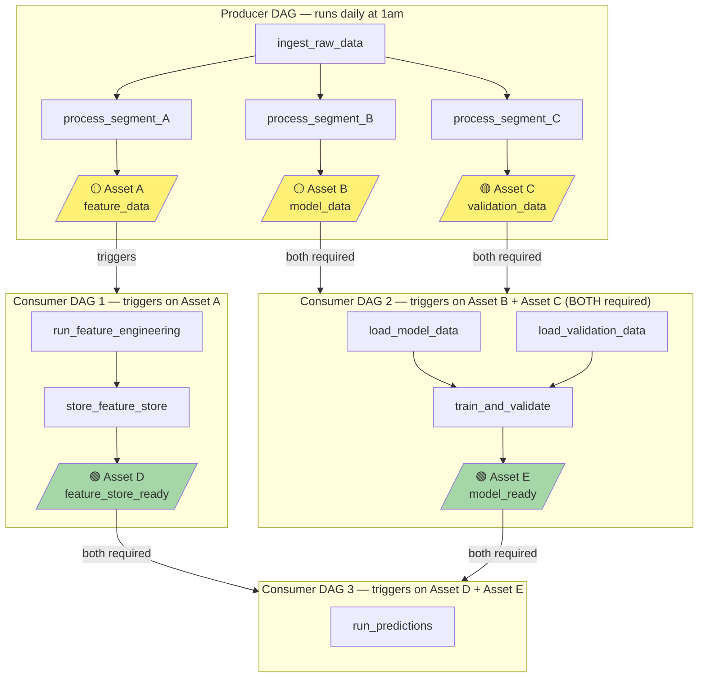
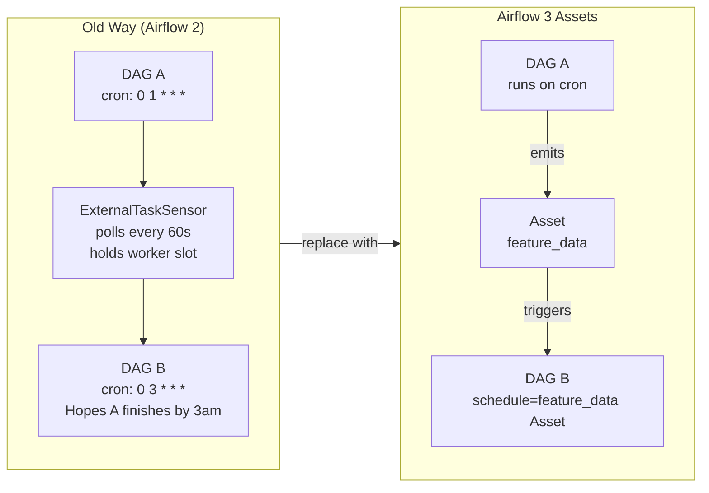

# 🔴 Project 06 — Event-Driven Asset Pipeline (Airflow 3)

> **Level:** Advanced | **Est. Time:** 4–6 hours | **Skills:** Assets, @asset decorator, multi-asset dependencies, asset lineage, Airflow 3 scheduling model

---

## The Story

You have multiple data pipelines that depend on each other. The old approach: cron schedules with ExternalTaskSensor. The problem: the sensor polls every 60 seconds, holds a worker slot, and if the upstream DAG runs late, your downstream DAG fails the sensor timeout.

Airflow 3's Assets solve this elegantly. Instead of time-based scheduling ("run at 2am and hope the data is ready"), you use event-driven scheduling ("run when this specific data is ready").

This project builds a three-DAG system:
- **Producer DAG** — ingests raw data and emits three Assets (A, B, C)
- **Consumer DAG 1** — triggers automatically when Asset A is ready → runs feature engineering
- **Consumer DAG 2** — triggers automatically when **both** Asset B **and** Asset C are ready → runs model training

No polling. No sensors. No cron overlap issues.

---

## The Full System



---

## Key Concept: Assets vs ExternalTaskSensor



**The difference:**
- No polling — event-driven
- No worker slot held waiting
- If DAG A runs late (data arrives at 4am instead of 2am), DAG B still triggers correctly
- Full lineage visible in Airflow 3 UI

---

## Asset Definitions

```python
# assets.py — shared asset definitions
# Import these in both producer and consumer DAGs

from airflow.sdk import Asset

# Producer outputs
feature_data_asset = Asset("s3://data-lake/features/daily/{{ ds }}/")
model_data_asset   = Asset("s3://data-lake/model-input/daily/{{ ds }}/")
validation_asset   = Asset("s3://data-lake/validation/daily/{{ ds }}/")

# Consumer outputs
feature_store_asset = Asset("feature_store://churn_features/latest")
model_ready_asset   = Asset("model://churn-prediction/latest")
```

---

## Producer DAG

```python
"""
producer_dag.py
---------------
Ingests raw data and emits three Assets.
Consumer DAGs listen for these assets and trigger automatically.
"""

from airflow.sdk import DAG, Asset, task
from datetime import datetime

# Import shared asset definitions
from assets import feature_data_asset, model_data_asset, validation_asset

with DAG(
    dag_id="data_producer",
    schedule="0 1 * * *",          # Runs at 1am
    start_date=datetime(2024, 1, 1),
    catchup=False,
    tags=["producer", "assets"],
) as dag:

    @task
    def ingest_raw_data(**context) -> dict:
        """Pull raw data from source systems."""
        # In production: call your APIs, read from CDC, etc.
        print(f"Ingesting raw data for {context['ds']}")
        return {"rows": 1_234_567, "date": context["ds"]}

    @task(outlets=[feature_data_asset])     # Emits Asset A when this task succeeds
    def process_segment_a(raw_stats: dict, **context):
        """
        Process feature engineering data.
        The 'outlets=[feature_data_asset]' decorator automatically emits
        the asset when this task completes successfully.
        """
        print(f"Processing feature data for {raw_stats['rows']} rows")
        # Write output to S3 — the path matches the Asset URI
        # In production: df.to_parquet(f"s3://data-lake/features/daily/{context['ds']}/")
        return {"feature_rows": raw_stats["rows"]}

    @task(outlets=[model_data_asset])       # Emits Asset B
    def process_segment_b(raw_stats: dict, **context):
        """Process model training data."""
        print(f"Processing model input data")
        return {"model_rows": raw_stats["rows"]}

    @task(outlets=[validation_asset])       # Emits Asset C
    def process_segment_c(raw_stats: dict, **context):
        """Process validation/holdout data."""
        print(f"Processing validation data")
        return {"validation_rows": raw_stats["rows"] // 10}   # 10% holdout

    # ── Task dependencies ────────────────────────────────────────
    raw = ingest_raw_data()
    # B and C can run in parallel after ingest
    process_segment_a(raw)
    process_segment_b(raw)
    process_segment_c(raw)
```

---

## Consumer DAG 1 — Triggers on Asset A

```python
"""
consumer_dag_1.py
-----------------
Triggers automatically when feature_data_asset is updated.
No cron schedule. No sensor. Event-driven.
"""

from airflow.sdk import DAG, Asset, task
from datetime import datetime

from assets import feature_data_asset, feature_store_asset

with DAG(
    dag_id="feature_engineering",

    # This is the key: instead of cron, we schedule on an Asset
    # This DAG runs every time feature_data_asset is emitted
    schedule=[feature_data_asset],

    start_date=datetime(2024, 1, 1),
    catchup=False,
    tags=["consumer", "features"],
) as dag:

    @task
    def run_feature_engineering(**context):
        """
        Read the feature data that was just produced and engineer features.

        context["data_interval_start"] tells us which run of the producer
        emitted the asset — useful for backfills.
        """
        print(f"Running feature engineering triggered by asset update")
        print(f"Data interval: {context['data_interval_start']}")

        # Read from the asset location
        # In production: df = pd.read_parquet(f"s3://data-lake/features/daily/{ds}/")
        features = {
            "feature_count": 47,
            "customer_count": 12_456,
        }
        return features

    @task(outlets=[feature_store_asset])    # Emits Asset D when done
    def store_features(features: dict):
        """Write features to the feature store and emit Asset D."""
        print(f"Storing {features['feature_count']} features for "
              f"{features['customer_count']} customers")
        # In production: write to feast, Tecton, Hopsworks, etc.

    store_features(run_feature_engineering())
```

---

## Consumer DAG 2 — Triggers on Asset B AND Asset C (Both Required)

```python
"""
consumer_dag_2.py
-----------------
Only triggers when BOTH model_data_asset AND validation_asset
are available from the same producer run.

This is multi-asset dependency — critical for correctness.
"""

from airflow.sdk import DAG, Asset, task
from datetime import datetime

from assets import model_data_asset, validation_asset, model_ready_asset

with DAG(
    dag_id="model_training",

    # Multi-asset dependency: needs BOTH assets before triggering
    # If only B is ready, this DAG waits. If only C, it waits.
    # Only when BOTH are emitted (by the same producer run) does this trigger.
    schedule=[model_data_asset, validation_asset],

    start_date=datetime(2024, 1, 1),
    catchup=False,
    tags=["consumer", "ml", "training"],
) as dag:

    @task
    def load_model_data(**context):
        """Load model training data."""
        print("Loading model training data...")
        return {"model_rows": 1_100_000}

    @task
    def load_validation_data(**context):
        """Load holdout validation data."""
        print("Loading validation data...")
        return {"validation_rows": 110_000}

    @task(outlets=[model_ready_asset])      # Emits Asset E
    def train_and_validate(model_data: dict, val_data: dict):
        """
        Train the model with training data, validate with holdout.
        Emit model_ready_asset when done.
        """
        print(f"Training on {model_data['model_rows']} rows")
        print(f"Validating on {val_data['validation_rows']} rows")

        # Simulate training...
        metrics = {"accuracy": 0.943, "f1": 0.937}
        print(f"Training complete: {metrics}")

        return metrics

    model = load_model_data()
    val = load_validation_data()
    train_and_validate(model, val)
```

---

## Viewing Asset Lineage

In the Airflow 3 UI, navigate to **Assets** to see the full lineage graph:

```
data_producer
    ├── emits ──► feature_data_asset ──► triggers ──► feature_engineering
    ├── emits ──► model_data_asset ─────┐
    │                                   ├──► triggers ──► model_training
    └── emits ──► validation_asset ─────┘

feature_engineering
    └── emits ──► feature_store_asset ──► triggers ──► predictions

model_training
    └── emits ──► model_ready_asset ────► triggers ──► predictions
```

This is the Airflow 3 asset lineage graph — visible in the UI, queryable via the REST API, and exportable for data governance.

---

## What You'll Learn

| Skill | Where it appears |
|-------|-----------------|
| `Asset()` definition | Defining named assets in a shared file |
| `outlets=[asset]` on `@task` | Emitting an asset when a task succeeds |
| `schedule=[asset]` | Triggering a DAG when an asset is updated |
| Multi-asset `schedule=[A, B]` | Waiting for ALL listed assets before triggering |
| Asset lineage UI | Visualising the full producer-consumer graph |
| Event-driven vs cron | Why this is better than ExternalTaskSensor |

---

## Extension Challenges

1. **Conditional asset emission** — only emit the asset if row count > 1M (use `return AssetEventExtra(...)`)
2. **Asset with metadata** — attach the accuracy metric to the model_ready_asset so consumers know the quality
3. **Backfill behaviour** — trigger the producer for yesterday's date; watch the consumers catch up automatically
4. **Failed producer** — what happens to consumers if the producer fails halfway through? (Answer: Asset B and C not emitted → consumer DAG 2 doesn't trigger)

---

## See Also

- [Airflow 3 Assets →](../../../05_Airflow_3_Features/31_Assets/Theory.md) — Full Asset documentation
- [ML Training Pipeline →](../05_ML_Training_Pipeline/Project_Guide.md) — Uses Assets in an ML context
