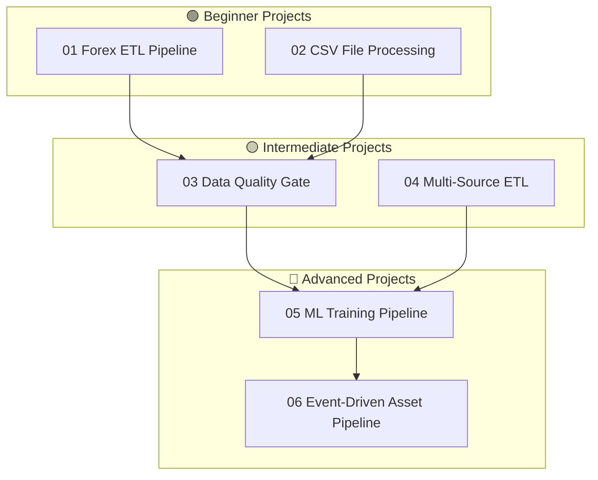

⬅️ [Integrations](../07_Integrations/Readme.md) &nbsp;|&nbsp; 🏠 [Home](../00_Learning_Guide/Readme.md) &nbsp;|&nbsp; [Home ➡️](../00_Learning_Guide/Readme.md)

---

# 🛠️ Projects

> *Reading about Airflow builds knowledge. Building with it builds skill. These six projects take you from a simple ETL pipeline to a full event-driven ML pipeline using Airflow 3 Assets.*

---

## At a Glance

| | |
|---|---|
| **Projects** | 6 total (2 beginner, 2 intermediate, 2 advanced) |
| **Est. Time** | 20–30 hours total |
| **Prerequisites** | Varies by project level |

---

## All Projects

| # | Project | Level | Tools Used | Skills Practiced |
|---|---------|-------|-----------|-----------------|
| 01 | [Forex ETL Pipeline](01_Beginner_Projects/01_Forex_ETL_Pipeline/Project_Guide.md) | 🟢 Beginner | HttpSensor, PythonOperator, PostgresOperator, BashOperator | API polling, DB writes, email alerts |
| 02 | [CSV File Processing](01_Beginner_Projects/02_Simple_File_Processing/Project_Guide.md) | 🟢 Beginner | FileSensor, PythonOperator, BashOperator, XCom | File detection, validation, XCom data passing |
| 03 | [Data Quality Gate](02_Intermediate_Projects/03_Data_Quality_Pipeline/Project_Guide.md) | 🟡 Intermediate | S3, BranchPythonOperator, TaskGroup, XCom, callbacks | Quality checks, branching, quarantine pattern |
| 04 | [Multi-Source ETL](02_Intermediate_Projects/04_Multi_Source_ETL/Project_Guide.md) | 🟡 Intermediate | Dynamic Task Mapping, XCom, TaskGroup, Pools | Dynamic parallelism, merging sources |
| 05 | [ML Training Pipeline](03_Advanced_Projects/05_ML_Training_Pipeline/Project_Guide.md) | 🔴 Advanced | KubernetesPodOperator, Assets, BranchPythonOperator, Pools | Model training, evaluation, conditional registration |
| 06 | [Event-Driven Asset Pipeline](03_Advanced_Projects/06_Event_Driven_Asset_Pipeline/Project_Guide.md) | 🔴 Advanced | Assets, @asset decorator, multi-asset deps | Airflow 3 event-driven scheduling, asset lineage |

---

## Project Paths

---

## Beginner Projects

### 01 — Forex ETL Pipeline
**What you build:** A DAG that polls a public forex API, waits for the exchange rate data to be available, stores results in PostgreSQL, and emails a daily summary.

**Skills:** HttpSensor (poll API), PythonOperator (process data), PostgresOperator (write to DB), email notification

[Project Guide →](01_Beginner_Projects/01_Forex_ETL_Pipeline/Project_Guide.md) | [Code Example →](01_Beginner_Projects/01_Forex_ETL_Pipeline/Code_Example.md)

---

### 02 — CSV File Processing Pipeline
**What you build:** A DAG that watches a landing folder for CSV files, validates the schema and content when one appears, and moves it to a processed folder — passing the validation report via XCom.

**Skills:** FileSensor (watch folder), PythonOperator (validate), BashOperator (move file), XCom (pass report)

[Project Guide →](01_Beginner_Projects/02_Simple_File_Processing/Project_Guide.md) | [Code Example →](01_Beginner_Projects/02_Simple_File_Processing/Code_Example.md)

---

## Intermediate Projects

### 03 — Data Quality Gate Pipeline
**What you build:** Load data from S3, run five automated quality checks (nulls, duplicates, range, schema, freshness), then branch: if all checks pass → load to warehouse; if any fail → quarantine the file and send a Slack alert.

**Skills:** S3 operators, BranchPythonOperator, TaskGroup, XCom, on_failure_callback

[Project Guide →](02_Intermediate_Projects/03_Data_Quality_Pipeline/Project_Guide.md)

---

### 04 — Multi-Source ETL Pipeline
**What you build:** Extract from three sources in parallel using Dynamic Task Mapping (Postgres, REST API, S3 CSV), transform and merge the data, then load to a data warehouse.

**Skills:** Dynamic Task Mapping (`expand()`), XCom, TaskGroup, Pools, concurrency control

[Project Guide →](02_Intermediate_Projects/04_Multi_Source_ETL/Project_Guide.md)

---

## Advanced Projects

### 05 — ML Training Pipeline
**What you build:** A full ML pipeline: load and preprocess data, train a model in a Kubernetes pod, evaluate metrics via XCom, then branch on accuracy — if good, register the model and emit an Asset to trigger a downstream serving DAG; if poor, alert the team.

**Skills:** KubernetesPodOperator, Assets (Airflow 3), BranchPythonOperator, Pools, Deferrable operators

[Project Guide →](03_Advanced_Projects/05_ML_Training_Pipeline/Project_Guide.md)

---

### 06 — Event-Driven Asset Pipeline
**What you build:** A producer DAG that ingests raw data and emits three Assets. Consumer DAG 1 triggers automatically when Asset A is ready. Consumer DAG 2 triggers only when both Asset B and Asset C are ready. Full event-driven orchestration with asset lineage visible in the Airflow 3 UI.

**Skills:** Assets, `@asset` decorator, multi-asset dependencies, asset lineage, Airflow 3 scheduling model

[Project Guide →](03_Advanced_Projects/06_Event_Driven_Asset_Pipeline/Project_Guide.md)

---

⬅️ [Integrations](../07_Integrations/Readme.md) &nbsp;|&nbsp; 🏠 [Home](../00_Learning_Guide/Readme.md) &nbsp;|&nbsp; [Home ➡️](../00_Learning_Guide/Readme.md)

