**Zero to Production · Airflow 3 · Story-Based · Beginner Friendly**

## 🔥 What Is This Repo?

This is a complete, structured learning guide for **Apache Airflow 3** — from your very first DAG all the way to production deployments, cloud orchestration, and integrations with dbt, Spark, and Kubernetes.

Every topic follows the same format:

- 📖 **Theory.md** — A story-first explanation with real-world analogies, then the technical deep dive
- ⚡ **Cheatsheet.md** — Quick-reference card you'll bookmark forever
- 🎯 **Interview_QA.md** — Beginner → Advanced Q&A to test yourself
- 💻 **Code_Example.md** — Working code with comments, not just snippets

> **Airflow 3 only.** No legacy v1 content. Installation, architecture, and features all target Airflow 3.

## 🗺️ Section Overview

| # | Section | Topics | Level | Time |
|---|---------|--------|-------|------|
| 🟢 **01** | [Beginner](./01_Beginner/) | What is Airflow, Architecture, Install, First DAG, Core Operators | Beginner | 6–8 hrs |
| 🟡 **02** | [Intermediate](./02_Intermediate/) | All Operators, Sensors, Executors, Connections, XComs, TaskFlow, Jinja | Intermediate | 12–15 hrs |
| 🔴 **03** | [Advanced](./03_Advanced/) | Branching, Dynamic Tasks, Deferrable Ops, Testing, Custom Timetables | Advanced | 15–18 hrs |
| 🟣 **04** | [Expert](./04_Expert/) | Plugins, Custom Operators, Secrets, REST API, Performance, DAG Patterns | Expert | 12–15 hrs |
| 🔵 **05** | [Airflow 3 Features](./05_Airflow_3_Features/) | Assets, DAG Versioning, Auth Manager, Edge Executor, Object Storage | Airflow 3 | 10–12 hrs |
| ☁️ **06** | [Airflow on Cloud](./06_Airflow_on_Cloud/) | AWS EKS, MWAA, GCP Composer, Cloud Patterns | Cloud | 8–10 hrs |
| 🔗 **07** | [Integrations](./07_Integrations/) | dbt, Spark, Great Expectations, KubernetesPodOperator | Integration | 8–10 hrs |
| 🏗️ **08** | [Projects](./08_Projects/) | Forex ETL, File Processing, API Ingestion, ML Pipeline, Multi-Cloud | Projects | 15+ hrs |

**Total: ~90–100 hours of structured learning**

## 🛤️ Choose Your Path

<strong>🟢 Beginner Path — I'm new to Airflow (Start here!)</strong>

> Goal: Understand what Airflow is and write your first working DAG.

| Step | Module | What You'll Learn |
|------|--------|-------------------|
| 1 | [What is Airflow?](./01_Beginner/01_What_is_Airflow/Theory.md) | The problem Airflow solves, DAGs explained simply |
| 2 | [Airflow 3 Architecture](./01_Beginner/02_Airflow_3_Architecture/Theory.md) | Scheduler, API Server, DAG Processor, Workers |
| 3 | [Installation & Setup](./01_Beginner/03_Installation_and_Setup/Theory.md) | Docker Compose setup, first login, UI tour |
| 4 | [Your First DAG](./01_Beginner/04_Your_First_DAG/Theory.md) | Write, trigger, and debug a real DAG |
| 5 | [Core Operators](./01_Beginner/05_Core_Operators/Theory.md) | BashOperator, PythonOperator, EmailOperator |

**Prerequisite:** Basic Python. No Airflow experience needed.

<strong>🟡 Intermediate Path — I know the basics, want to build real pipelines</strong>

> Goal: Build production-grade workflows that connect to real systems.

| Step | Module | What You'll Learn |
|------|--------|-------------------|
| 6 | [All Operators](./02_Intermediate/06_All_Operators/Theory.md) | Postgres, S3, HTTP, Docker, Kubernetes operators |
| 7 | [Sensors](./02_Intermediate/07_Sensors/Theory.md) | FileSensor, HttpSensor, poke vs reschedule mode |
| 8 | [Executors](./02_Intermediate/08_Executors/Theory.md) | Local, Celery, Kubernetes, CeleryKubernetes |
| 9 | [Connections & Hooks](./02_Intermediate/09_Connections_and_Hooks/Theory.md) | Manage credentials, write custom hooks |
| 10 | [Variables & Config](./02_Intermediate/10_Variables_and_Config/Theory.md) | Airflow Variables, env vars, secrets |
| 11 | [XComs & TaskFlow](./02_Intermediate/11_XComs_and_TaskFlow/Theory.md) | Pass data between tasks, @task decorator |
| 12 | [Jinja Templates](./02_Intermediate/12_Jinja_Templates_Macros/Theory.md) | Dynamic SQL, macros, ds, ts, data_interval_start |
| 13 | [DAG Params & Runtime](./02_Intermediate/13_DAG_Params_and_Runtime/Theory.md) | Parameterize DAGs, runtime configs |

**Prerequisite:** Beginner track complete.

<strong>🔴 Advanced Path — I want dynamic, testable, production-ready DAGs</strong>

> Goal: Write elegant, scalable DAGs that handle real-world complexity.

| Step | Module | What You'll Learn |
|------|--------|-------------------|
| 14 | [Branching & Control Flow](./03_Advanced/14_Branching_and_Control_Flow/Theory.md) | BranchOperator, TriggerRule, ShortCircuit |
| 15 | [Task Groups](./03_Advanced/15_Task_Groups/Theory.md) | Organize complex DAGs visually |
| 16 | [Dynamic Task Mapping](./03_Advanced/16_Dynamic_Task_Mapping/Theory.md) | expand(), map_index, cross-product |
| 17 | [Deferrable Operators](./03_Advanced/17_Deferrable_Operators/Theory.md) | async tasks, BaseTrigger, Triggerer service |
| 18 | [Callbacks & SLAs](./03_Advanced/18_Callbacks_and_SLAs/Theory.md) | on_failure_callback, SLA misses, alerting |
| 19 | [Pools & Resources](./03_Advanced/19_Pools_and_Resources/Theory.md) | Concurrency control, priority weights |
| 20 | [Monitoring & Alerting](./03_Advanced/20_Monitoring_and_Alerting/Theory.md) | StatsD, Prometheus, Grafana, alerts |
| 21 | [Testing DAGs](./03_Advanced/21_Testing_DAGs/Theory.md) | Unit tests, DAG validation, pytest |
| 22 | [Custom Timetables](./03_Advanced/22_Custom_Timetables/Theory.md) | Business-day schedules, custom cron logic |

**Prerequisite:** Intermediate track complete.

<strong>🟣 Expert Path — I'm going deep on internals and architecture</strong>

> Goal: Extend Airflow, optimize it, and own it end-to-end.

| Step | Module | What You'll Learn |
|------|--------|-------------------|
| 23 | [Plugins & Customization](./04_Expert/23_Plugins_and_Customization/Theory.md) | AirflowPlugin, custom views, listeners |
| 24 | [Custom Operators & Hooks](./04_Expert/24_Custom_Operators_and_Hooks/Theory.md) | Build your own operators from scratch |
| 25 | [Secrets & Security](./04_Expert/25_Secrets_and_Security/Theory.md) | HashiCorp Vault, AWS Secrets Manager, GCP SM |
| 26 | [REST API](./04_Expert/26_REST_API/Theory.md) | Trigger DAGs via API, CI/CD integration |
| 27 | [Performance Optimization](./04_Expert/27_Performance_Optimization/Theory.md) | Tune scheduler, parse time, DB bottlenecks |
| 28 | [Remote Logging](./04_Expert/28_Remote_Logging/Theory.md) | S3, GCS, Azure Blob log backends |
| 29 | [DAG Patterns & Best Practices](./04_Expert/29_DAG_Patterns_Best_Practices/Theory.md) | Design patterns, anti-patterns, code review |

**Prerequisite:** Advanced track complete.

<strong>🔵 Airflow 3 Path — What's new and how to use it</strong>

> Goal: Master the new features that shipped with Airflow 3.

| Step | Module | What You'll Learn |
|------|--------|-------------------|
| 30 | [What's New in Airflow 3](./05_Airflow_3_Features/30_Whats_New_in_Airflow_3/Theory.md) | Full change log, migration guide |
| 31 | [Asset-Driven Scheduling](./05_Airflow_3_Features/31_Asset_Driven_Scheduling/Theory.md) | Assets (Datasets v2), event-driven DAGs |
| 32 | [DAG Versioning](./05_Airflow_3_Features/32_DAG_Versioning/Theory.md) | Version history, rollbacks |
| 33 | [New Auth Manager](./05_Airflow_3_Features/33_New_Auth_Manager/Theory.md) | Pluggable auth, replace FAB |
| 34 | [Edge Executor](./05_Airflow_3_Features/34_Edge_Executor/Theory.md) | Run tasks at the edge, lightweight workers |
| 35 | [Event-Driven Scheduling](./05_Airflow_3_Features/35_Event_Driven_Scheduling/Theory.md) | Reacting to external events |
| 36 | [Object Storage API](./05_Airflow_3_Features/36_Object_Storage/Theory.md) | ObjectStoragePath, unified storage access |

**Prerequisite:** Intermediate track + basic Airflow 2 knowledge helpful.

## 📚 Full Curriculum

<strong>🟢 Section 01 — Beginner (5 modules)</strong>

| Module | Theory | Cheatsheet | Interview Q&A | Code |
|--------|--------|------------|---------------|------|
| 01 · What is Airflow | [📖](./01_Beginner/01_What_is_Airflow/Theory.md) | [⚡](./01_Beginner/01_What_is_Airflow/Cheatsheet.md) | [🎯](./01_Beginner/01_What_is_Airflow/Interview_QA.md) | — |
| 02 · Airflow 3 Architecture | [📖](./01_Beginner/02_Airflow_3_Architecture/Theory.md) | [⚡](./01_Beginner/02_Airflow_3_Architecture/Cheatsheet.md) | [🎯](./01_Beginner/02_Airflow_3_Architecture/Interview_QA.md) | [Component Deep Dive](./01_Beginner/02_Airflow_3_Architecture/Component_Deep_Dive.md) |
| 03 · Installation & Setup | [📖](./01_Beginner/03_Installation_and_Setup/Theory.md) | [⚡](./01_Beginner/03_Installation_and_Setup/Cheatsheet.md) | [🎯](./01_Beginner/03_Installation_and_Setup/Interview_QA.md) | [Docker Setup](./01_Beginner/03_Installation_and_Setup/Docker_Setup.md) |
| 04 · Your First DAG | [📖](./01_Beginner/04_Your_First_DAG/Theory.md) | [⚡](./01_Beginner/04_Your_First_DAG/Cheatsheet.md) | [🎯](./01_Beginner/04_Your_First_DAG/Interview_QA.md) | [💻](./01_Beginner/04_Your_First_DAG/Code_Example.md) |
| 05 · Core Operators | [📖](./01_Beginner/05_Core_Operators/Theory.md) | [⚡](./01_Beginner/05_Core_Operators/Cheatsheet.md) | [🎯](./01_Beginner/05_Core_Operators/Interview_QA.md) | [💻](./01_Beginner/05_Core_Operators/Code_Example.md) |

<strong>🟡 Section 02 — Intermediate (8 modules)</strong>

| Module | Theory | Cheatsheet | Interview Q&A | Extra |
|--------|--------|------------|---------------|-------|
| 06 · All Operators | [📖](./02_Intermediate/06_All_Operators/Theory.md) | [⚡](./02_Intermediate/06_All_Operators/Cheatsheet.md) | [🎯](./02_Intermediate/06_All_Operators/Interview_QA.md) | [Comparison](./02_Intermediate/06_All_Operators/Operators_Comparison.md) |
| 07 · Sensors | [📖](./02_Intermediate/07_Sensors/Theory.md) | [⚡](./02_Intermediate/07_Sensors/Cheatsheet.md) | [🎯](./02_Intermediate/07_Sensors/Interview_QA.md) | — |
| 08 · Executors | [📖](./02_Intermediate/08_Executors/Theory.md) | [⚡](./02_Intermediate/08_Executors/Cheatsheet.md) | [🎯](./02_Intermediate/08_Executors/Interview_QA.md) | — |
| 09 · Connections & Hooks | [📖](./02_Intermediate/09_Connections_and_Hooks/Theory.md) | [⚡](./02_Intermediate/09_Connections_and_Hooks/Cheatsheet.md) | [🎯](./02_Intermediate/09_Connections_and_Hooks/Interview_QA.md) | — |
| 10 · Variables & Config | [📖](./02_Intermediate/10_Variables_and_Config/Theory.md) | [⚡](./02_Intermediate/10_Variables_and_Config/Cheatsheet.md) | [🎯](./02_Intermediate/10_Variables_and_Config/Interview_QA.md) | — |
| 11 · XComs & TaskFlow | [📖](./02_Intermediate/11_XComs_and_TaskFlow/Theory.md) | [⚡](./02_Intermediate/11_XComs_and_TaskFlow/Cheatsheet.md) | [🎯](./02_Intermediate/11_XComs_and_TaskFlow/Interview_QA.md) | — |
| 12 · Jinja Templates & Macros | [📖](./02_Intermediate/12_Jinja_Templates_Macros/Theory.md) | [⚡](./02_Intermediate/12_Jinja_Templates_Macros/Cheatsheet.md) | [🎯](./02_Intermediate/12_Jinja_Templates_Macros/Interview_QA.md) | [Macros Reference](./02_Intermediate/12_Jinja_Templates_Macros/Macros_Reference.md) |
| 13 · DAG Params & Runtime | [📖](./02_Intermediate/13_DAG_Params_and_Runtime/Theory.md) | [⚡](./02_Intermediate/13_DAG_Params_and_Runtime/Cheatsheet.md) | [🎯](./02_Intermediate/13_DAG_Params_and_Runtime/Interview_QA.md) | — |

<strong>🔴 Section 03 — Advanced (9 modules)</strong>

| Module | Theory | Cheatsheet | Interview Q&A | Extra |
|--------|--------|------------|---------------|-------|
| 14 · Branching & Control Flow | [📖](./03_Advanced/14_Branching_and_Control_Flow/Theory.md) | [⚡](./03_Advanced/14_Branching_and_Control_Flow/Cheatsheet.md) | [🎯](./03_Advanced/14_Branching_and_Control_Flow/Interview_QA.md) | — |
| 15 · Task Groups | [📖](./03_Advanced/15_Task_Groups/Theory.md) | [⚡](./03_Advanced/15_Task_Groups/Cheatsheet.md) | [🎯](./03_Advanced/15_Task_Groups/Interview_QA.md) | — |
| 16 · Dynamic Task Mapping | [📖](./03_Advanced/16_Dynamic_Task_Mapping/Theory.md) | [⚡](./03_Advanced/16_Dynamic_Task_Mapping/Cheatsheet.md) | [🎯](./03_Advanced/16_Dynamic_Task_Mapping/Interview_QA.md) | [💻](./03_Advanced/16_Dynamic_Task_Mapping/Code_Example.md) |
| 17 · Deferrable Operators | [📖](./03_Advanced/17_Deferrable_Operators/Theory.md) | [⚡](./03_Advanced/17_Deferrable_Operators/Cheatsheet.md) | [🎯](./03_Advanced/17_Deferrable_Operators/Interview_QA.md) | [💻](./03_Advanced/17_Deferrable_Operators/Code_Example.md) |
| 18 · Callbacks & SLAs | [📖](./03_Advanced/18_Callbacks_and_SLAs/Theory.md) | [⚡](./03_Advanced/18_Callbacks_and_SLAs/Cheatsheet.md) | [🎯](./03_Advanced/18_Callbacks_and_SLAs/Interview_QA.md) | — |
| 19 · Pools & Resources | [📖](./03_Advanced/19_Pools_and_Resources/Theory.md) | [⚡](./03_Advanced/19_Pools_and_Resources/Cheatsheet.md) | [🎯](./03_Advanced/19_Pools_and_Resources/Interview_QA.md) | — |
| 20 · Monitoring & Alerting | [📖](./03_Advanced/20_Monitoring_and_Alerting/Theory.md) | [⚡](./03_Advanced/20_Monitoring_and_Alerting/Cheatsheet.md) | [🎯](./03_Advanced/20_Monitoring_and_Alerting/Interview_QA.md) | — |
| 21 · Testing DAGs | [📖](./03_Advanced/21_Testing_DAGs/Theory.md) | [⚡](./03_Advanced/21_Testing_DAGs/Cheatsheet.md) | [🎯](./03_Advanced/21_Testing_DAGs/Interview_QA.md) | [💻](./03_Advanced/21_Testing_DAGs/Code_Example.md) |
| 22 · Custom Timetables | [📖](./03_Advanced/22_Custom_Timetables/Theory.md) | [⚡](./03_Advanced/22_Custom_Timetables/Cheatsheet.md) | [🎯](./03_Advanced/22_Custom_Timetables/Interview_QA.md) | — |

<strong>🟣 Section 04 — Expert (7 modules)</strong>

| Module | Theory | Cheatsheet | Interview Q&A | Code |
|--------|--------|------------|---------------|------|
| 23 · Plugins & Customization | [📖](./04_Expert/23_Plugins_and_Customization/Theory.md) | [⚡](./04_Expert/23_Plugins_and_Customization/Cheatsheet.md) | [🎯](./04_Expert/23_Plugins_and_Customization/Interview_QA.md) | [💻](./04_Expert/23_Plugins_and_Customization/Code_Example.md) |
| 24 · Custom Operators & Hooks | [📖](./04_Expert/24_Custom_Operators_and_Hooks/Theory.md) | [⚡](./04_Expert/24_Custom_Operators_and_Hooks/Cheatsheet.md) | [🎯](./04_Expert/24_Custom_Operators_and_Hooks/Interview_QA.md) | [💻](./04_Expert/24_Custom_Operators_and_Hooks/Code_Example.md) |
| 25 · Secrets & Security | [📖](./04_Expert/25_Secrets_and_Security/Theory.md) | [⚡](./04_Expert/25_Secrets_and_Security/Cheatsheet.md) | [🎯](./04_Expert/25_Secrets_and_Security/Interview_QA.md) | [💻](./04_Expert/25_Secrets_and_Security/Code_Example.md) |
| 26 · REST API | [📖](./04_Expert/26_REST_API/Theory.md) | [⚡](./04_Expert/26_REST_API/Cheatsheet.md) | [🎯](./04_Expert/26_REST_API/Interview_QA.md) | [💻](./04_Expert/26_REST_API/Code_Example.md) |
| 27 · Performance Optimization | [📖](./04_Expert/27_Performance_Optimization/Theory.md) | [⚡](./04_Expert/27_Performance_Optimization/Cheatsheet.md) | [🎯](./04_Expert/27_Performance_Optimization/Interview_QA.md) | — |
| 28 · Remote Logging | [📖](./04_Expert/28_Remote_Logging/Theory.md) | [⚡](./04_Expert/28_Remote_Logging/Cheatsheet.md) | [🎯](./04_Expert/28_Remote_Logging/Interview_QA.md) | — |
| 29 · DAG Patterns & Best Practices | [📖](./04_Expert/29_DAG_Patterns_Best_Practices/Theory.md) | [⚡](./04_Expert/29_DAG_Patterns_Best_Practices/Cheatsheet.md) | [🎯](./04_Expert/29_DAG_Patterns_Best_Practices/Interview_QA.md) | — |

<strong>🔵 Section 05 — Airflow 3 Features (7 modules)</strong>

| Module | Theory | Cheatsheet | Interview Q&A | Code |
|--------|--------|------------|---------------|------|
| 30 · What's New in Airflow 3 | [📖](./05_Airflow_3_Features/30_Whats_New_in_Airflow_3/Theory.md) | [⚡](./05_Airflow_3_Features/30_Whats_New_in_Airflow_3/Cheatsheet.md) | [🎯](./05_Airflow_3_Features/30_Whats_New_in_Airflow_3/Interview_QA.md) | — |
| 31 · Asset-Driven Scheduling | [📖](./05_Airflow_3_Features/31_Asset_Driven_Scheduling/Theory.md) | [⚡](./05_Airflow_3_Features/31_Asset_Driven_Scheduling/Cheatsheet.md) | [🎯](./05_Airflow_3_Features/31_Asset_Driven_Scheduling/Interview_QA.md) | [💻](./05_Airflow_3_Features/31_Asset_Driven_Scheduling/Code_Example.md) |
| 32 · DAG Versioning | [📖](./05_Airflow_3_Features/32_DAG_Versioning/Theory.md) | [⚡](./05_Airflow_3_Features/32_DAG_Versioning/Cheatsheet.md) | [🎯](./05_Airflow_3_Features/32_DAG_Versioning/Interview_QA.md) | — |
| 33 · New Auth Manager | [📖](./05_Airflow_3_Features/33_New_Auth_Manager/Theory.md) | [⚡](./05_Airflow_3_Features/33_New_Auth_Manager/Cheatsheet.md) | [🎯](./05_Airflow_3_Features/33_New_Auth_Manager/Interview_QA.md) | — |
| 34 · Edge Executor | [📖](./05_Airflow_3_Features/34_Edge_Executor/Theory.md) | [⚡](./05_Airflow_3_Features/34_Edge_Executor/Cheatsheet.md) | [🎯](./05_Airflow_3_Features/34_Edge_Executor/Interview_QA.md) | — |
| 35 · Event-Driven Scheduling | [📖](./05_Airflow_3_Features/35_Event_Driven_Scheduling/Theory.md) | [⚡](./05_Airflow_3_Features/35_Event_Driven_Scheduling/Cheatsheet.md) | [🎯](./05_Airflow_3_Features/35_Event_Driven_Scheduling/Interview_QA.md) | — |
| 36 · Object Storage API | [📖](./05_Airflow_3_Features/36_Object_Storage/Theory.md) | [⚡](./05_Airflow_3_Features/36_Object_Storage/Cheatsheet.md) | [🎯](./05_Airflow_3_Features/36_Object_Storage/Interview_QA.md) | [💻](./05_Airflow_3_Features/36_Object_Storage/Code_Example.md) |

<strong>☁️ Section 06 — Airflow on Cloud (4 modules)</strong>

| Module | Theory | Extra |
|--------|--------|-------|
| 37 · Cloud Deployment Overview | [📖](./06_Airflow_on_Cloud/37_Cloud_Overview/Theory.md) | [Comparison](./06_Airflow_on_Cloud/37_Cloud_Overview/Comparison.md) |
| 38 · AWS EKS Deployment | [📖](./06_Airflow_on_Cloud/38_AWS_EKS/Theory.md) | — |
| 39 · AWS MWAA | [📖](./06_Airflow_on_Cloud/39_MWAA/Theory.md) | — |
| 40 · GCP Cloud Composer | [📖](./06_Airflow_on_Cloud/40_GCP_Composer/Theory.md) | — |

<strong>🔗 Section 07 — Integrations (4 modules)</strong>

| Module | Theory | Code |
|--------|--------|------|
| 41 · Airflow + dbt | [📖](./07_Integrations/41_dbt_Integration/Theory.md) | [💻](./07_Integrations/41_dbt_Integration/Code_Example.md) |
| 42 · Airflow + Spark | [📖](./07_Integrations/42_Spark_Integration/Theory.md) | [💻](./07_Integrations/42_Spark_Integration/Code_Example.md) |
| 43 · Great Expectations | [📖](./07_Integrations/43_Great_Expectations/Theory.md) | [💻](./07_Integrations/43_Great_Expectations/Code_Example.md) |
| 44 · KubernetesPodOperator Deep Dive | [📖](./07_Integrations/44_KubernetesPodOperator_Deep_Dive/Theory.md) | [💻](./07_Integrations/44_KubernetesPodOperator_Deep_Dive/Code_Example.md) |

<strong>🏗️ Section 08 — Projects (6 projects)</strong>

| Project | Level | What You Build |
|---------|-------|----------------|
| [Forex ETL Pipeline](./08_Projects/01_Beginner_Projects/01_Forex_ETL_Pipeline/) | Beginner | Download forex rates → transform → load to Postgres |
| [File Processing Pipeline](./08_Projects/01_Beginner_Projects/02_Simple_File_Processing/) | Beginner | Watch a folder, process CSV files, archive results |
| [API Ingestion Pipeline](./08_Projects/02_Intermediate_Projects/) | Intermediate | Pull from REST API daily, deduplicate, store in warehouse |
| [dbt + Airflow Pipeline](./08_Projects/02_Intermediate_Projects/) | Intermediate | Orchestrate dbt models end-to-end |
| [ML Training Pipeline](./08_Projects/03_Advanced_Projects/) | Advanced | Airflow-orchestrated ML: ingest → train → evaluate → register |
| [Multi-Cloud ETL](./08_Projects/03_Advanced_Projects/) | Advanced | Cross-cloud data movement with error handling and SLAs |

## 📦 What Every Topic Includes

| File | Purpose |
|------|---------|
| 📖 `Theory.md` | Story-first explanation · real analogies · Mermaid diagrams · deep dive |
| ⚡ `Cheatsheet.md` | Quick-reference card · commands · patterns · when to use |
| 🎯 `Interview_QA.md` | 10+ Q&As from beginner → advanced level |
| 💻 `Code_Example.md` | Working, runnable code with line-by-line comments |
| 🔍 `*_Deep_Dive.md` | Component internals for complex topics |
| 📊 `*_Comparison.md` | Side-by-side comparisons (e.g. all executors) |

## 🚀 Start Here

**New to Airflow?** → [What is Airflow?](./01_Beginner/01_What_is_Airflow/Theory.md)

**Want to install first?** → [Installation & Setup (Docker)](./01_Beginner/03_Installation_and_Setup/Docker_Setup.md)

**Upgrading from Airflow 2?** → [What's New in Airflow 3](./05_Airflow_3_Features/30_Whats_New_in_Airflow_3/Theory.md)

**Know basics, want to build?** → [Your First DAG](./01_Beginner/04_Your_First_DAG/Theory.md)

**Need a reference?** → [Airflow CLI Commands](./airflow_commands.md)

**Track your progress** → [Progress Tracker](./00_Learning_Guide/Progress_Tracker.md)

## 🗂️ Quick Reference

| Resource | Link |
|----------|------|
| 📍 Learning Path | [00_Learning_Guide/Learning_Path.md](./00_Learning_Guide/Learning_Path.md) |
| 📋 How to Use This Repo | [00_Learning_Guide/How_to_Use_This_Repo.md](./00_Learning_Guide/How_to_Use_This_Repo.md) |
| ✅ Progress Tracker | [00_Learning_Guide/Progress_Tracker.md](./00_Learning_Guide/Progress_Tracker.md) |
| ⌨️ CLI Commands | [airflow_commands.md](./airflow_commands.md) |
| 🌍 Forex Project | [forex_datapipeline/](./forex_datapipeline/) |

*Apache Airflow 3 · Zero to Production · Story-Based Learning*

